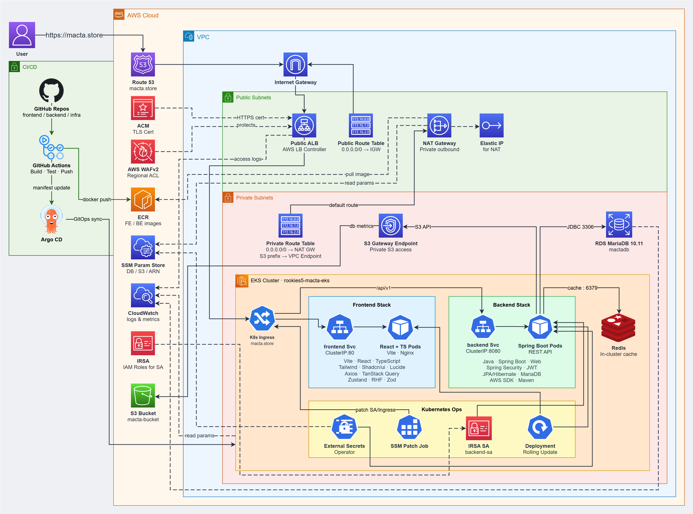

#  실시간 경매 플랫폼 MACTA

## 💻 Developers

| <a href="https://github.com/owhat02" target="_blank"></a> | <a href="https://github.com/Eojinn" target="_blank"></a> | <a href="https://github.com/Hyeonseok93" target="_blank"></a> | <a href="https://github.com/mmije0ng" target="_blank"></a> | <a href="https://github.com/seoyeon020" target="_blank"></a> | <a href="https://github.com/JangSeonguk1011" target="_blank"></a> |
| :----------------------------------------------------------------------------------------------------------------------------: | :--------------------------------------------------------------------------------------------------------------------------: | :------------------------------------------------------------------------------------------------------------------------------------: | :------------------------------------------------------------------------------------------------------------------------------: | :----------------------------------------------------------------------------------------------------------------------------------: | :--------------------------------------------------------------------------------------------------------------------------------------------: |
|                                           [이새연(팀장)](https://github.com/owhat02)                                           |                                             [김어진](https://github.com/Eojinn)                                              |                                                [김현석](https://github.com/Hyeonseok93)                                                |                                              [박미정](https://github.com/mmije0ng)                                               |                                               [임서연](https://github.com/seoyeon020)                                                |                                                  [장성욱](https://github.com/JangSeonguk1011)                                                  |

---

> [!NOTE]
> **SK쉴더스 루키즈 5기**에서 AWS 기반 클라우드 인프라 구축과 CI/CD 파이프라인 교육을 진행한 뒤 이어진 **세 번째 미니 프로젝트**입니다.

## 🚀 Overview

실시간 경매는 마감이 다가올수록 입찰이 한꺼번에 몰리고, 동시성 문제와 비정상 트래픽에 그대로 노출되기 쉽습니다. **MACTA**는 상품 등록부터 실시간 입찰·낙찰·결제까지 **한 흐름으로 이어지는** 경매 플랫폼입니다.

React에서 경매 탐색·입찰·알림 UI를 제공하고, Spring Boot가 **회원·경매·입찰·결제·알림**을 도메인별로 처리합니다. 입찰이 몰리는 구간은 **낙관적 락**으로 무결성을 지키고, ALB 앞단 **WAF**로 레이트 리밋·인젝션 등 비정상 요청을 걸러 냅니다.

**상품 등록 → 실시간 입찰 → 낙찰 → 결제·배송** 흐름 위에 JWT 인증, WebSocket 알림, Kubernetes 기반 배포·Rolling Update를 붙여 둔 실시간 경매 서비스입니다.

---

## 🛠 Built With

<p>
<picture>
  <source media="(prefers-color-scheme: dark)" srcset="assets/readme/badges/dark/typescript.png">
  <source media="(prefers-color-scheme: light)" srcset="assets/readme/badges/light/typescript.png">
  
</picture>
<picture>
  <source media="(prefers-color-scheme: dark)" srcset="assets/readme/badges/dark/react.png">
  <source media="(prefers-color-scheme: light)" srcset="assets/readme/badges/light/react.png">
  
</picture>
<picture>
  <source media="(prefers-color-scheme: dark)" srcset="assets/readme/badges/dark/vite.png">
  <source media="(prefers-color-scheme: light)" srcset="assets/readme/badges/light/vite.png">
  
</picture>
<picture>
  <source media="(prefers-color-scheme: dark)" srcset="assets/readme/badges/dark/reactrouter.png">
  <source media="(prefers-color-scheme: light)" srcset="assets/readme/badges/light/reactrouter.png">
  
</picture>
<picture>
  <source media="(prefers-color-scheme: dark)" srcset="assets/readme/badges/dark/tailwindcss.png">
  <source media="(prefers-color-scheme: light)" srcset="assets/readme/badges/light/tailwindcss.png">
  
</picture>
<picture>
  <source media="(prefers-color-scheme: dark)" srcset="assets/readme/badges/dark/tanstackquery.png">
  <source media="(prefers-color-scheme: light)" srcset="assets/readme/badges/light/tanstackquery.png">
  
</picture>
<picture>
  <source media="(prefers-color-scheme: dark)" srcset="assets/readme/badges/dark/zustand.png">
  <source media="(prefers-color-scheme: light)" srcset="assets/readme/badges/light/zustand.png">
  
</picture>
<picture>
  <source media="(prefers-color-scheme: dark)" srcset="assets/readme/badges/dark/axios.png">
  <source media="(prefers-color-scheme: light)" srcset="assets/readme/badges/light/axios.png">
  
</picture>
<picture>
  <source media="(prefers-color-scheme: dark)" srcset="assets/readme/badges/dark/reacthookform.png">
  <source media="(prefers-color-scheme: light)" srcset="assets/readme/badges/light/reacthookform.png">
  
</picture>
<picture>
  <source media="(prefers-color-scheme: dark)" srcset="assets/readme/badges/dark/zod.png">
  <source media="(prefers-color-scheme: light)" srcset="assets/readme/badges/light/zod.png">
  
</picture>
<picture>
  <source media="(prefers-color-scheme: dark)" srcset="assets/readme/badges/dark/java.png">
  <source media="(prefers-color-scheme: light)" srcset="assets/readme/badges/light/java.png">
  
</picture>
<picture>
  <source media="(prefers-color-scheme: dark)" srcset="assets/readme/badges/dark/springboot.png">
  <source media="(prefers-color-scheme: light)" srcset="assets/readme/badges/light/springboot.png">
  
</picture>
<picture>
  <source media="(prefers-color-scheme: dark)" srcset="assets/readme/badges/dark/springsecurity.png">
  <source media="(prefers-color-scheme: light)" srcset="assets/readme/badges/light/springsecurity.png">
  
</picture>
<picture>
  <source media="(prefers-color-scheme: dark)" srcset="assets/readme/badges/dark/jwt.png">
  <source media="(prefers-color-scheme: light)" srcset="assets/readme/badges/light/jwt.png">
  
</picture>
<picture>
  <source media="(prefers-color-scheme: dark)" srcset="assets/readme/badges/dark/hibernate.png">
  <source media="(prefers-color-scheme: light)" srcset="assets/readme/badges/light/hibernate.png">
  
</picture>
<picture>
  <source media="(prefers-color-scheme: dark)" srcset="assets/readme/badges/dark/mariadb.png">
  <source media="(prefers-color-scheme: light)" srcset="assets/readme/badges/light/mariadb.png">
  
</picture>
<picture>
  <source media="(prefers-color-scheme: dark)" srcset="assets/readme/badges/dark/redis.png">
  <source media="(prefers-color-scheme: light)" srcset="assets/readme/badges/light/redis.png">
  
</picture>
<picture>
  <source media="(prefers-color-scheme: dark)" srcset="assets/readme/badges/dark/maven.png">
  <source media="(prefers-color-scheme: light)" srcset="assets/readme/badges/light/maven.png">
  
</picture>
<picture>
  <source media="(prefers-color-scheme: dark)" srcset="assets/readme/badges/dark/docker.png">
  <source media="(prefers-color-scheme: light)" srcset="assets/readme/badges/light/docker.png">
  
</picture>
<picture>
  <source media="(prefers-color-scheme: dark)" srcset="assets/readme/badges/dark/kubernetes.png">
  <source media="(prefers-color-scheme: light)" srcset="assets/readme/badges/light/kubernetes.png">
  
</picture>
<picture>
  <source media="(prefers-color-scheme: dark)" srcset="assets/readme/badges/dark/terraform.png">
  <source media="(prefers-color-scheme: light)" srcset="assets/readme/badges/light/terraform.png">
  
</picture>
<picture>
  <source media="(prefers-color-scheme: dark)" srcset="assets/readme/badges/dark/githubactions.png">
  <source media="(prefers-color-scheme: light)" srcset="assets/readme/badges/light/githubactions.png">
  
</picture>
<picture>
  <source media="(prefers-color-scheme: dark)" srcset="assets/readme/badges/dark/argocd.png">
  <source media="(prefers-color-scheme: light)" srcset="assets/readme/badges/light/argocd.png">
  
</picture>
</p>

<details>
<summary><strong>기술 스택 상세 보기</strong></summary>

<br>

<div align="center">

<table align="center">
  <thead>
    <tr>
      <th align="left">구분</th>
      <th align="left">기술</th>
      <th align="left">역할</th>
    </tr>
  </thead>
  <tbody>
    <tr>
      <td align="left"><strong>Frontend Core</strong></td>
      <td align="left">TypeScript 6.0.2, React/React DOM 19.2.5, Vite 8.0.10</td>
      <td align="left">타입 안전한 SPA 렌더링·개발 서버·프로덕션 번들</td>
    </tr>
    <tr>
      <td align="left"><strong>Routing &amp; UI</strong></td>
      <td align="left">React Router DOM 7.15.0, Tailwind CSS 4.2.4, Shadcn/ui · Radix UI, Lucide React</td>
      <td align="left">페이지 라우팅, 유틸리티 퍼스트 스타일링, 공통 UI 프리미티브·아이콘</td>
    </tr>
    <tr>
      <td align="left"><strong>State &amp; HTTP</strong></td>
      <td align="left">TanStack Query 5.100.9, Zustand 5.0.13, Axios 1.16.0</td>
      <td align="left">서버 상태 캐싱·동기화, 클라이언트 전역 상태, JWT 인터셉터 기반 API 통신</td>
    </tr>
    <tr>
      <td align="left"><strong>Form &amp; Validation</strong></td>
      <td align="left">React Hook Form 7.75.0, Zod 4.4.3</td>
      <td align="left">경매 등록·입찰·결제 폼 상태 관리와 스키마 기반 입력 검증</td>
    </tr>
    <tr>
      <td align="left"><strong>Backend Core</strong></td>
      <td align="left">Java 17, Spring Boot 3.5.14, Spring Web, Spring Data JPA, Spring Validation, Spring WebSocket</td>
      <td align="left">REST API·서비스 계층·요청 검증·실시간 알림 채널</td>
    </tr>
    <tr>
      <td align="left"><strong>Persistence</strong></td>
      <td align="left">Hibernate ORM, MariaDB JDBC, Redis, H2</td>
      <td align="left">경매·입찰 영속화, @Version 낙관적 락, 캐시·실시간 상태 보조, 테스트용 인메모리 DB</td>
    </tr>
    <tr>
      <td align="left"><strong>Security</strong></td>
      <td align="left">Spring Security, JWT, BCrypt</td>
      <td align="left">인증·인가, 토큰 기반 API 보호, 비밀번호 해시</td>
    </tr>
    <tr>
      <td align="left"><strong>Storage &amp; Cloud SDK</strong></td>
      <td align="left">AWS SDK (S3 / STS)</td>
      <td align="left">상품 이미지 업로드·Presigned URL, IRSA 기반 권한 위임</td>
    </tr>
    <tr>
      <td align="left"><strong>Build &amp; Container</strong></td>
      <td align="left">Maven, Docker, ECR</td>
      <td align="left">백엔드 빌드·이미지 패키징·컨테이너 레지스트리 배포</td>
    </tr>
    <tr>
      <td align="left"><strong>Infrastructure</strong></td>
      <td align="left">Terraform, VPC, Public/Private Subnet, Internet Gateway, NAT Gateway, ALB, EKS, Kubernetes, AWS Load Balancer Controller, RDS MariaDB, Redis, S3, WAFv2, ACM, IRSA, SSM Parameter Store, External Secrets Operator</td>
      <td align="left">IaC 기반 네트워크·클러스터·DB·스토리지·보안·시크릿 구성</td>
    </tr>
    <tr>
      <td align="left"><strong>CI/CD &amp; Ops</strong></td>
      <td align="left">GitHub Actions, Argo CD, Kubernetes Rolling Update, CloudWatch</td>
      <td align="left">이미지 빌드·푸시, GitOps 동기화, 무중단 배포, 운영 로그·메트릭</td>
    </tr>
  </tbody>
</table>

</div>

</details>

---

## 🖥️ Preview · [자세히 보기](https://bulldog93.tistory.com/47)

<div align="center">
  
  <p>메인 페이지</p>
</div>

<div align="center">

<table align="center">
  <thead>
    <tr>
      <th align="left">화면</th>
      <th align="left">설명</th>
    </tr>
  </thead>
  <tbody>
    <tr>
      <td align="left">🏠 홈</td>
      <td align="left">카테고리·가격·검색·정렬, 인기·마감 임박 통계, 라이브 경매 카드 목록</td>
    </tr>
    <tr>
      <td align="left">🔐 로그인</td>
      <td align="left">JWT 기반 로그인, 인가된 API 요청</td>
    </tr>
    <tr>
      <td align="left">✍️ 회원가입</td>
      <td align="left">계정 생성 후 서비스 이용 시작</td>
    </tr>
    <tr>
      <td align="left">📄 경매 상세</td>
      <td align="left">실시간 최고가·입찰·마감 카운트다운, Q&amp;A 댓글·답글</td>
    </tr>
    <tr>
      <td align="left">🔨 경매 등록</td>
      <td align="left">이미지·시작가·카테고리·마감 시각 설정</td>
    </tr>
    <tr>
      <td align="left">💳 결제</td>
      <td align="left">낙찰 후 결제 대기, 최종가·결제 수단 확인</td>
    </tr>
    <tr>
      <td align="left">👤 마이페이지</td>
      <td align="left">입찰·낙찰 통계, 닉네임·프로필 관리</td>
    </tr>
    <tr>
      <td align="left">📋 내 출품 관리</td>
      <td align="left">판매 중·종료 상품 확인, 결제 완료 건 배송 시작</td>
    </tr>
    <tr>
      <td align="left">📨 입찰 내역</td>
      <td align="left">대기·낙찰·상회 상태 추적, 낙찰 건 결제 진입</td>
    </tr>
    <tr>
      <td align="left">❤️ 관심 목록</td>
      <td align="left">워치리스트 상품 모아보기·관심 해제</td>
    </tr>
    <tr>
      <td align="left">🔔 알림</td>
      <td align="left">상회 입찰·낙찰 등 실시간 이벤트 모음</td>
    </tr>
  </tbody>
</table>

</div>

---

## 🌟 Key Implementation

1. **낙관적 락으로 동시 입찰 무결성 보장**  
   마감 직전 여러 입찰이 동시에 들어와도 최고가가 어긋나지 않도록, Auction 엔티티에 `@Version` 낙관적 락을 적용했습니다.
   - 입찰 시 **현재 최고가 검증**과 **최고가 갱신**을 한 트랜잭션에서 처리합니다.
   - 먼저 커밋된 요청만 반영하고, 버전 충돌이 난 요청은 실패시켜 Race Condition·중복 갱신을 막습니다.

2. **서버 시간 동기화 + 폴링 기반 라이브 입찰 UX**  
   클라이언트 시계가 어긋나면 마감 카운트다운과 입찰 가능 여부가 틀어질 수 있어, 서버 시각과의 **오프셋**을 맞춰 둡니다.
   - 상세 화면에서는 짧은 주기로 경매·입찰 상태를 **폴링**해 최고가·잔여 시간을 거의 실시간에 가깝게 갱신합니다.
   - 사용자는 새로고침 없이도 경쟁 중인 최고가 변화를 따라갈 수 있습니다.

3. **스케줄러 기반 경매 자동 종료·낙찰 확정**  
   관리자가 일일이 마감하지 않아도 되도록, 백엔드 스케줄러가 종료 시각이 지난 경매를 주기적으로 조회합니다.
   - 이미 종료된 건은 제외해 **중복 마감**을 피하고, 최고 입찰자를 낙찰자로 확정합니다.
   - 입찰이 없는 경매는 낙찰자 없이 종료해 결제·배송 단계가 생기지 않도록 분기합니다.

4. **낙찰 후 결제·배송 역할 분리**  
   경매 종료 후 거래는 **낙찰자 결제 → 판매자 배송** 순으로 이어집니다.
   - 결제 대기·결제 완료·배송 중·거래 완료 상태를 구분해, 역할별로 필요한 액션만 노출합니다.
   - 마이페이지·결제 화면에서 낙찰 건 결제와 출품 건 배송 시작을 이어 갈 수 있습니다.

5. **ALB 앞단 AWS WAF로 비정상 트래픽 차단**  
   애플리케이션에 도달하기 전에 **WAF**로 SQL Injection·XSS·과도한 반복 요청 등을 걸러 냅니다.
   - Rate Limit Rule로 짧은 구간의 IP별 폭주를 완화하고, 입찰·로그인 등 민감 API에 대한 악성 호출을 줄입니다.
   - 보안 규칙을 인프라 계층에 두어 앱 코드 변경 없이도 공통 정책을 유지합니다.

6. **GitOps(Argo CD) + Kubernetes Rolling Update**  
   이미지 빌드·ECR Push 후 Infra Manifest 변경을 **Argo CD**가 감지해 EKS 상태를 동기화합니다.
   - Rolling Update로 Pod를 순차 교체하고, Readiness Probe를 통과한 뒤 트래픽을 받아 배포 중 중단을 최소화합니다.
   - 배포 이력과 설정이 Git에 남아 추적·롤백이 쉽습니다.

---

## 🗂 Domain Model & API

Spring Boot REST API가 **회원(User) · 경매(Auction) · 입찰(Bid) · 결제(Payment) · 알림(Notification) · 댓글(Comment) · 관심(AuctionLike) · 이미지(Picture)** 를 도메인으로 관리합니다.

- 한 회원이 **판매자(seller)** 로 경매를 등록하고, 다른 회원은 **입찰(Bid)** 로 경쟁합니다. 종료 시 **낙찰자(winner)** 가 확정되며 상태는 `READY → LIVE → FINISHED → PAID → SHIPPING → COMPLETED` 흐름을 따릅니다.
- 입찰이 몰리는 구간에서는 Auction의 `@Version` **낙관적 락**으로 최고가 갱신을 직렬화하고, 관심 상품은 **AuctionLike**(회원–경매)로, Q&A는 **Comment**의 `parent`/`children`으로 질문·답글을 구성합니다.
- 낙찰 후 **Payment**(경매 1:1, `PENDING → COMPLETED`)로 결제를 기록하고, 배송·거래 완료는 Auction 상태로 이어집니다. **Notification**은 `OUTBID` · `AUCTION_WON` · `CLOSING_SOON` 등 유형별로 수신자에게 전달됩니다.

주요 엔드포인트는 `/api/v1/auth`(가입·로그인·중복 확인), `/api/v1/auctions`(목록·상세·등록·관심·입찰), `/api/v1/users/me`(프로필·출품·입찰·관심 목록), `/api/v1/payments`·배송·거래 완료(Trade), `/api/v1/notifications`, `/api/v1/auctions/{id}/comments`, `/api/v1/images`·`/api/v1/categories`로 나뉩니다.

> 상세 ERD 한 장과 주요 API 표(설계 의도 포함)는 [기술 블로그](https://bulldog93.tistory.com/47)에서 다룹니다.

---

## 📂 Project Structure

```text
SK-Rookies5-MINI3_MACTA/
┣━━ 📂 assets/                              # README용 에셋
┃   ┗━━ 📂 readme/
┃       ┣━━ 📂 badges/dark|light/           # Built With 뱃지 (다크·라이트)
┃       ┣━━ 🖼️ logo.png                     # README 타이틀 로고
┃       ┗━━ 🖼️ preview-home.png             # Preview 스크린샷
┣━━ 📂 MACTA-frontend/                      # React 클라이언트
┃   ┣━━ 📂 src/
┃   ┃   ┣━━ 📂 api/                         # Axios 인스턴스 · auction/auth/user API
┃   ┃   ┣━━ 📂 components/                  # Header·Footer · 타이머·모달 · UI 컴포넌트
┃   ┃   ┣━━ 📂 hooks/                       # useAuctions 등 데이터 훅
┃   ┃   ┣━━ 📂 pages/                       # 홈 · 상세 · 등록 · 결제 · 마이페이지 · 알림
┃   ┃   ┣━━ 📂 store/                       # Zustand (인증 · 서버 시간 오프셋)
┃   ┃   ┣━━ 📂 styles/                      # 전역 CSS
┃   ┃   ┣━━ 📂 utils/                       # 가격·날짜 포맷 · 카테고리 · 이미지 URL
┃   ┃   ┣━━ 📄 App.tsx                      # 라우팅 · AuthGuard
┃   ┃   ┗━━ 📄 main.tsx                     # 앱 진입점
┃   ┣━━ 📄 Dockerfile                       # 프론트 이미지 빌드
┃   ┣━━ 📄 nginx.conf                       # 정적 서빙 · SPA 라우팅
┃   ┗━━ 📄 package.json
┣━━ 📂 MACTA-backend/                       # Spring Boot REST API
┃   ┣━━ 📂 src/main/java/.../auction/
┃   ┃   ┣━━ 📂 config/                      # S3 · Jackson 직렬화 설정
┃   ┃   ┣━━ 📂 controller/                  # /api/v1 REST 컨트롤러
┃   ┃   ┣━━ 📂 domain/                      # Auction · Bid · Payment 등 JPA 엔티티
┃   ┃   ┣━━ 📂 dto/                         # 요청·응답 DTO
┃   ┃   ┣━━ 📂 event/                       # 도메인 이벤트 정의
┃   ┃   ┣━━ 📂 listener/                    # 이벤트 수신 · 알림 생성
┃   ┃   ┣━━ 📂 exception/                   # 비즈니스·전역 예외 처리
┃   ┃   ┣━━ 📂 global/                      # Spring Security · JWT 필터
┃   ┃   ┣━━ 📂 repository/                  # Spring Data JPA
┃   ┃   ┣━━ 📂 scheduler/                   # 만료 경매 자동 종료·낙찰
┃   ┃   ┣━━ 📂 service/                     # 입찰 · 거래 · 알림 비즈니스 로직
┃   ┃   ┗━━ 📄 AuctionApplication.java      # 애플리케이션 진입점
┃   ┣━━ 📂 src/main/resources/
┃   ┃   ┗━━ 📄 application.yaml             # DB · Redis · JWT 설정
┃   ┣━━ 📄 Dockerfile                       # 백엔드 이미지 빌드 (Maven → JRE)
┃   ┣━━ 📄 docker-compose.yml               # 로컬 Backend + Redis 기동
┃   ┣━━ 📄 .dockerignore
┃   ┣━━ 📄 pom.xml
┃   ┗━━ 📄 .env.example                     # 환경 변수 템플릿
┣━━ 📂 MACTA-infra/                         # 클라우드 인프라 · 배포
┃   ┣━━ 📂 terraform/                       # VPC · EKS · ALB/WAF · RDS · S3 · ECR
┃   ┣━━ 📂 k8s/                             # Deployment · Service · Ingress · Redis
┃   ┣━━ 📂 argocd/                          # GitOps Application 정의
┃   ┗━━ 📂 scripts/                         # IRSA(ServiceAccount↔IAM) 설정
┗━━ 📄 README.md
```

---

## 🏗 Infrastructure Overview

<div align="center">
  
</div>

**Route53 → WAF/ACM → ALB → EKS(Frontend·Backend) → RDS·Redis·S3** 로 이어지는 AWS 기반 아키텍처입니다. 사용자 트래픽은 ALB까지만 도달하고, 애플리케이션과 데이터 계층은 Private Subnet 안에서만 통신합니다. 배포는 **GitHub Actions → ECR → Argo CD(GitOps)** 로 자동화됩니다.

> 네트워크 분리·보안(WAF·IRSA·Secret 관리)·무중단 배포 등 상세한 설계 의도는 [기술 블로그](https://bulldog93.tistory.com/47)에서 다룹니다.

---

## ⚙️ Getting Started

### Prerequisites

- JDK 17 이상
- Node.js 20.19+ (LTS 22 권장) 및 npm — Vite 8 요구 사항
- MariaDB 10.x 이상
- Docker / Docker Compose (Backend + Redis 컨테이너 실행용)

### 1. 레포지토리 클론

```bash
git clone https://github.com/Hyeonseok93/SK-Rookies5-MINI3_MACTA.git
cd SK-Rookies5-MINI3_MACTA
```

### 2. Database 설정

MariaDB에 프로젝트용 스키마를 생성합니다. (Docker Compose는 DB를 포함하지 않고, 호스트의 MariaDB를 `host.docker.internal`로 사용합니다)

```sql
CREATE DATABASE mactadb;
```

### 3. Backend 실행 (Docker Compose)

`MACTA-backend`의 `.env.example`을 복사해 `.env`를 만들고 값을 채웁니다. (Git에 커밋하지 않습니다)

```bash
cd MACTA-backend
cp .env.example .env   # Windows: copy .env.example .env
```

```env
DB_URL=jdbc:mariadb://host.docker.internal:3306/mactadb?serverTimezone=Asia/Seoul&characterEncoding=UTF-8
DB_USERNAME=root
DB_PASSWORD=change-me
JWT_SECRET=replace_with_a_random_secret_of_at_least_32_characters
REDIS_HOST=redis
REDIS_PORT=6379
REDIS_PASSWORD=change-me

# ---------------
# AWS / S3
# ---------------
S3_BUCKET_NAME=your-private-bucket-name
# 로컬에서만 필요할 때 채움. 비우면 기본 AWS 자격 증명(또는 IAM)을 사용.
AWS_ACCESS_KEY=
AWS_SECRET_KEY=
```

> 이미지 업로드를 쓰려면 실제 S3 버킷이 필요합니다. 배포 환경에서는 IRSA로 권한을 부여하며, Access Key를 넣지 않습니다.

`docker compose`로 백엔드와 Redis를 한 번에 띄웁니다.

```bash
docker compose up --build
```

백엔드 서버는 `http://localhost:8080`, Redis는 `localhost:6379`에서 구동됩니다.

> Docker 없이 직접 실행하려면 로컬에 Redis를 띄운 뒤 `.env`의 `REDIS_HOST`를 `localhost`,
> `DB_URL` 호스트를 `localhost`로 바꾸고 `./mvnw spring-boot:run`(Windows: `mvnw.cmd spring-boot:run`)을 사용합니다.

### 4. Frontend 실행

```bash
cd MACTA-frontend
```

`MACTA-frontend/.env.development`에 API 주소를 설정합니다.

```env
VITE_API_BASE_URL=http://localhost:8080/api/v1
```

```bash
npm install
npm run dev
```

프론트엔드 웹 앱은 `http://localhost:5173`에서 확인할 수 있습니다. 프로덕션에서는 같은 origin의 `/api/v1`을 ALB Ingress가 백엔드로 라우팅한다는 전제를 사용합니다.
