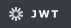
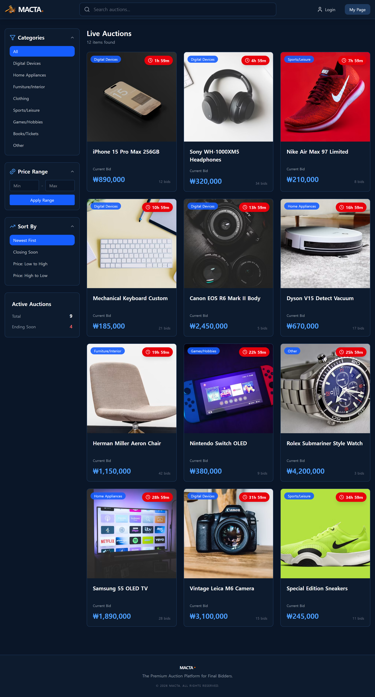
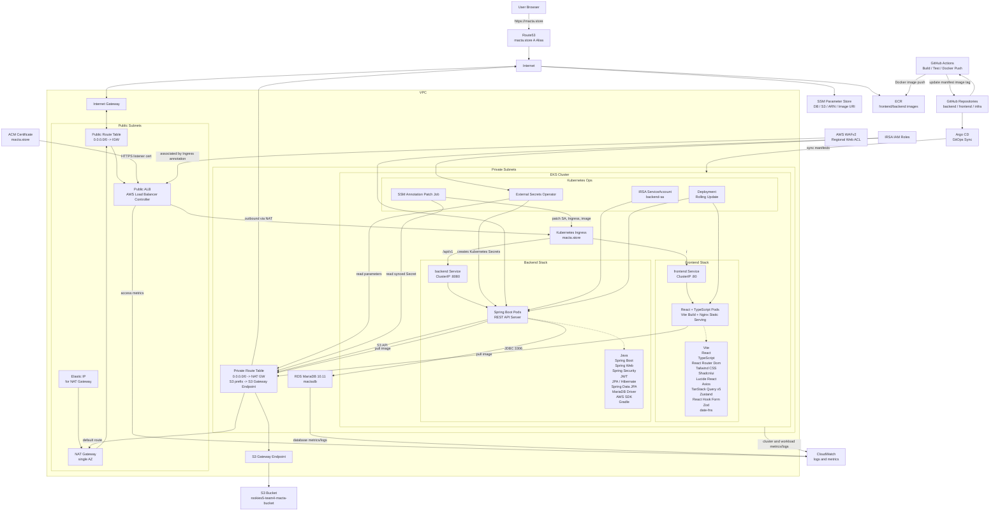
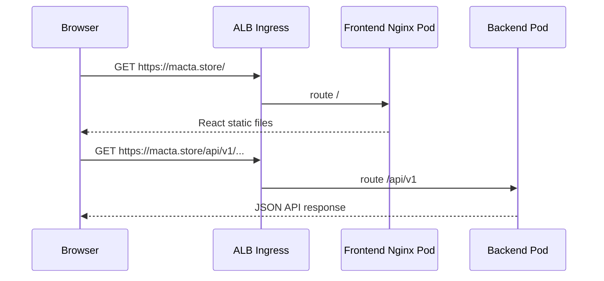

#  실시간 경매 플랫폼 MACTA

## 💻 Developers

| <a href="https://github.com/owhat02" target="_blank"></a> | <a href="https://github.com/Eojinn" target="_blank"></a> | <a href="https://github.com/Hyeonseok93" target="_blank"></a> | <a href="https://github.com/mmije0ng" target="_blank"></a> | <a href="https://github.com/seoyeon020" target="_blank"></a> | <a href="https://github.com/JangSeonguk1011" target="_blank"></a> |
| :----------------------------------------------------------------------------------------------------------------------------: | :--------------------------------------------------------------------------------------------------------------------------: | :------------------------------------------------------------------------------------------------------------------------------------: | :------------------------------------------------------------------------------------------------------------------------------: | :----------------------------------------------------------------------------------------------------------------------------------: | :--------------------------------------------------------------------------------------------------------------------------------------------: |
|                                           [이새연(팀장)](https://github.com/owhat02)                                           |                                             [김어진](https://github.com/Eojinn)                                              |                                                [김현석](https://github.com/Hyeonseok93)                                                |                                              [박미정](https://github.com/mmije0ng)                                               |                                               [임서연](https://github.com/seoyeon020)                                                |                                                  [장성욱](https://github.com/JangSeonguk1011)                                                  |

---

> [!NOTE]
> **SK쉴더스 루키즈 5기**에서 AWS 기반 클라우드 인프라 구축과 CI/CD 파이프라인 교육을 진행한 뒤 이어진 **세 번째 미니 프로젝트**입니다.

## 🚀 Overview

실시간 경매는 마감이 다가올수록 입찰이 한꺼번에 몰리고, 그만큼 동시성 문제와 비정상 트래픽에 그대로 노출되기 쉽습니다. **MACTA**는 사용자가 상품을 등록하고 실시간으로 입찰하는 경매 플랫폼으로, 마감 직전 **트래픽이 집중되는 순간**과 다양한 **보안 위협** 속에서도 안정적으로 동작하도록 설계한 서비스입니다.

입찰이 몰리는 구간에서는 **낙관적 락** 기반 동시성 제어로 Race Condition·중복 갱신·데이터 무결성 문제를 막고, ALB 앞단에 **WAF**를 두어 IP별 요청 폭주(레이트 리밋), SQL Injection, XSS, 알려진 악성 요청 패턴 같은 비정상 트래픽을 사전에 차단합니다.

애플리케이션은 **Kubernetes** 위에서 컨테이너로 운영해 트래픽이 늘어도 서비스 확장과 복구가 가능하고, **Rolling Update**로 기존 Pod와 신규 Pod를 순차 교체해 새 버전을 배포하는 중에도 **서비스 중단을 최소화**합니다.

---

## 🛠 Built With

<p>
<picture>
  <source media="(prefers-color-scheme: dark)" srcset="assets/readme/badges/dark/typescript.png">
  <source media="(prefers-color-scheme: light)" srcset="assets/readme/badges/light/typescript.png">
  
</picture>
<picture>
  <source media="(prefers-color-scheme: dark)" srcset="assets/readme/badges/dark/react.png">
  <source media="(prefers-color-scheme: light)" srcset="assets/readme/badges/light/react.png">
  
</picture>
<picture>
  <source media="(prefers-color-scheme: dark)" srcset="assets/readme/badges/dark/vite.png">
  <source media="(prefers-color-scheme: light)" srcset="assets/readme/badges/light/vite.png">
  
</picture>
<picture>
  <source media="(prefers-color-scheme: dark)" srcset="assets/readme/badges/dark/reactrouter.png">
  <source media="(prefers-color-scheme: light)" srcset="assets/readme/badges/light/reactrouter.png">
  
</picture>
<picture>
  <source media="(prefers-color-scheme: dark)" srcset="assets/readme/badges/dark/tailwindcss.png">
  <source media="(prefers-color-scheme: light)" srcset="assets/readme/badges/light/tailwindcss.png">
  
</picture>
<picture>
  <source media="(prefers-color-scheme: dark)" srcset="assets/readme/badges/dark/tanstackquery.png">
  <source media="(prefers-color-scheme: light)" srcset="assets/readme/badges/light/tanstackquery.png">
  
</picture>
<picture>
  <source media="(prefers-color-scheme: dark)" srcset="assets/readme/badges/dark/zustand.png">
  <source media="(prefers-color-scheme: light)" srcset="assets/readme/badges/light/zustand.png">
  
</picture>
<picture>
  <source media="(prefers-color-scheme: dark)" srcset="assets/readme/badges/dark/axios.png">
  <source media="(prefers-color-scheme: light)" srcset="assets/readme/badges/light/axios.png">
  
</picture>
<picture>
  <source media="(prefers-color-scheme: dark)" srcset="assets/readme/badges/dark/reacthookform.png">
  <source media="(prefers-color-scheme: light)" srcset="assets/readme/badges/light/reacthookform.png">
  
</picture>
<picture>
  <source media="(prefers-color-scheme: dark)" srcset="assets/readme/badges/dark/zod.png">
  <source media="(prefers-color-scheme: light)" srcset="assets/readme/badges/light/zod.png">
  
</picture>
<picture>
  <source media="(prefers-color-scheme: dark)" srcset="assets/readme/badges/dark/java.png">
  <source media="(prefers-color-scheme: light)" srcset="assets/readme/badges/light/java.png">
  
</picture>
<picture>
  <source media="(prefers-color-scheme: dark)" srcset="assets/readme/badges/dark/springboot.png">
  <source media="(prefers-color-scheme: light)" srcset="assets/readme/badges/light/springboot.png">
  
</picture>
<picture>
  <source media="(prefers-color-scheme: dark)" srcset="assets/readme/badges/dark/springsecurity.png">
  <source media="(prefers-color-scheme: light)" srcset="assets/readme/badges/light/springsecurity.png">
  
</picture>
<picture>
  <source media="(prefers-color-scheme: dark)" srcset="assets/readme/badges/dark/jwt.png">
  <source media="(prefers-color-scheme: light)" srcset="assets/readme/badges/light/jwt.png">
  
</picture>
<picture>
  <source media="(prefers-color-scheme: dark)" srcset="assets/readme/badges/dark/hibernate.png">
  <source media="(prefers-color-scheme: light)" srcset="assets/readme/badges/light/hibernate.png">
  
</picture>
<picture>
  <source media="(prefers-color-scheme: dark)" srcset="assets/readme/badges/dark/mariadb.png">
  <source media="(prefers-color-scheme: light)" srcset="assets/readme/badges/light/mariadb.png">
  
</picture>
<picture>
  <source media="(prefers-color-scheme: dark)" srcset="assets/readme/badges/dark/redis.png">
  <source media="(prefers-color-scheme: light)" srcset="assets/readme/badges/light/redis.png">
  
</picture>
<picture>
  <source media="(prefers-color-scheme: dark)" srcset="assets/readme/badges/dark/maven.png">
  <source media="(prefers-color-scheme: light)" srcset="assets/readme/badges/light/maven.png">
  
</picture>
<picture>
  <source media="(prefers-color-scheme: dark)" srcset="assets/readme/badges/dark/docker.png">
  <source media="(prefers-color-scheme: light)" srcset="assets/readme/badges/light/docker.png">
  
</picture>
<picture>
  <source media="(prefers-color-scheme: dark)" srcset="assets/readme/badges/dark/kubernetes.png">
  <source media="(prefers-color-scheme: light)" srcset="assets/readme/badges/light/kubernetes.png">
  
</picture>
<picture>
  <source media="(prefers-color-scheme: dark)" srcset="assets/readme/badges/dark/terraform.png">
  <source media="(prefers-color-scheme: light)" srcset="assets/readme/badges/light/terraform.png">
  
</picture>
<picture>
  <source media="(prefers-color-scheme: dark)" srcset="assets/readme/badges/dark/githubactions.png">
  <source media="(prefers-color-scheme: light)" srcset="assets/readme/badges/light/githubactions.png">
  
</picture>
<picture>
  <source media="(prefers-color-scheme: dark)" srcset="assets/readme/badges/dark/argocd.png">
  <source media="(prefers-color-scheme: light)" srcset="assets/readme/badges/light/argocd.png">
  
</picture>
</p>

<details>
<summary><strong>기술 스택 상세 보기</strong></summary>

<br>

<div align="center">

<table align="center">
  <thead>
    <tr>
      <th align="left">구분</th>
      <th align="left">기술</th>
      <th align="left">역할</th>
    </tr>
  </thead>
  <tbody>
    <tr>
      <td align="left"><strong>Frontend Core</strong></td>
      <td align="left">TypeScript 6.0.2, React/React DOM 19.2.5, Vite 8.0.10</td>
      <td align="left">타입 안전한 SPA 렌더링·개발 서버·프로덕션 번들</td>
    </tr>
    <tr>
      <td align="left"><strong>Routing &amp; UI</strong></td>
      <td align="left">React Router DOM 7.15.0, Tailwind CSS 4.2.4, Shadcn/ui · Radix UI, Lucide React</td>
      <td align="left">페이지 라우팅, 유틸리티 퍼스트 스타일링, 공통 UI 프리미티브·아이콘</td>
    </tr>
    <tr>
      <td align="left"><strong>State &amp; HTTP</strong></td>
      <td align="left">TanStack Query 5.100.9, Zustand 5.0.13, Axios 1.16.0</td>
      <td align="left">서버 상태 캐싱·동기화, 클라이언트 전역 상태, JWT 인터셉터 기반 API 통신</td>
    </tr>
    <tr>
      <td align="left"><strong>Form &amp; Validation</strong></td>
      <td align="left">React Hook Form 7.75.0, Zod 4.4.3</td>
      <td align="left">경매 등록·입찰·결제 폼 상태 관리와 스키마 기반 입력 검증</td>
    </tr>
    <tr>
      <td align="left"><strong>Backend Core</strong></td>
      <td align="left">Java 17, Spring Boot 3.5.14, Spring Web, Spring Data JPA, Spring Validation, Spring WebSocket</td>
      <td align="left">REST API·서비스 계층·요청 검증·실시간 알림 채널</td>
    </tr>
    <tr>
      <td align="left"><strong>Persistence</strong></td>
      <td align="left">Hibernate ORM, MariaDB JDBC, Redis, H2</td>
      <td align="left">경매·입찰 영속화, @Version 낙관적 락, 캐시·실시간 상태 보조, 테스트용 인메모리 DB</td>
    </tr>
    <tr>
      <td align="left"><strong>Security</strong></td>
      <td align="left">Spring Security, JWT, BCrypt</td>
      <td align="left">인증·인가, 토큰 기반 API 보호, 비밀번호 해시</td>
    </tr>
    <tr>
      <td align="left"><strong>Storage &amp; Cloud SDK</strong></td>
      <td align="left">AWS SDK (S3 / STS)</td>
      <td align="left">상품 이미지 업로드·Presigned URL, IRSA 기반 권한 위임</td>
    </tr>
    <tr>
      <td align="left"><strong>Build &amp; Container</strong></td>
      <td align="left">Maven, Docker, ECR</td>
      <td align="left">백엔드 빌드·이미지 패키징·컨테이너 레지스트리 배포</td>
    </tr>
    <tr>
      <td align="left"><strong>Infrastructure</strong></td>
      <td align="left">Terraform, VPC, Public/Private Subnet, Internet Gateway, NAT Gateway, ALB, EKS, Kubernetes, AWS Load Balancer Controller, RDS MariaDB, Redis, S3, WAFv2, ACM, IRSA, SSM Parameter Store, External Secrets Operator</td>
      <td align="left">IaC 기반 네트워크·클러스터·DB·스토리지·보안·시크릿 구성</td>
    </tr>
    <tr>
      <td align="left"><strong>CI/CD &amp; Ops</strong></td>
      <td align="left">GitHub Actions, Argo CD, Kubernetes Rolling Update, CloudWatch</td>
      <td align="left">이미지 빌드·푸시, GitOps 동기화, 무중단 배포, 운영 로그·메트릭</td>
    </tr>
  </tbody>
</table>

</div>

</details>

---

## 🖥️ Preview · [자세히 보기](https://bulldog93.tistory.com/47)

<div align="center">
  
  <p>메인 페이지</p>
</div>

---

&nbsp;

## 📌 Application


&nbsp;

### 경매 비즈니스 로직


- 사용자가 **경매 상품**에 입찰하면 서버에서 **경매 진행 상태**, **종료 시간**, **현재 최고 입찰가**를 먼저 확인한 뒤 **입찰 가능 여부**를 판단
- **입찰 금액**은 현재 최고 입찰가보다 높은 경우에만 허용하여 **낮은 금액 입찰**이나 **동일 금액 중복 입찰**이 저장되지 않도록 검증
- **음수 금액**, **0원 입찰**, **필수 값 누락**, 종료된 경매에 대한 입찰 요청 등 **비정상 요청**을 사전에 차단하도록 **입력값 검증**을 수행
- 유효한 입찰이 등록되면 경매의 **현재 최고가**와 **최고 입찰자 정보**를 함께 갱신하여 이후 사용자에게 **최신 입찰 상태**가 반영되도록 처리
- **경매 종료 시점**에는 경매 상태를 **CLOSED**로 변경하고 마지막 최고 입찰자를 **최종 낙찰자**로 확정하여 **거래 단계**로 이어질 수 있도록 구성
- **댓글 및 답글 기능**을 제공하여 상품 상세 페이지에서 **구매 문의**, **판매자 답변**, 사용자 간 **질의응답**

&nbsp;

### 경매 종료 스케줄링


- **백엔드 스케줄러**가 일정 주기로 실행되며 진행 중인 경매 목록에서 **종료 시간이 지난 경매**를 조회
- **만료 대상 경매**를 선별할 때 이미 종료 처리된 경매는 제외하여 **중복 종료 처리**와 불필요한 **상태 변경**이 발생하지 않도록 구현
- 종료 시간이 지난 경매는 **추가 입찰**을 받을 수 없도록 상태를 변경하고, **현재 최고 입찰 내역**을 기준으로 **낙찰자**를 확정
- **입찰자가 존재하지 않는 경매**는 낙찰자 없이 종료 상태로 처리하여 **결제 및 배송 단계**가 생성되지 않도록 분기
- **스케줄러 기반 자동 처리**를 통해 관리자가 직접 경매를 마감하지 않아도 정해진 시간에 경매가 종료

&nbsp;

### 결제 및 배송


> **낙찰자 결제**


> **판매자 배송**

- 경매가 종료되고 **낙찰자**가 확정되면 해당 낙찰자를 기준으로 **거래 정보**가 생성되며 **결제 대기 상태**로 전환
- 낙찰자는 **마이페이지** 또는 **거래 화면**에서 낙찰 상품과 **최종 결제 금액**을 확인한 뒤 **결제 절차**를 진행 가능
- **결제 완료** 시 거래 상태를 결제 완료로 변경하고 판매자가 **배송 정보**를 입력하거나 배송을 시작할 수 있는 단계로 이어지도록 처리
- **판매자**는 결제 완료된 거래를 기준으로 배송을 진행하며, **배송 상태 변경 내역**이 구매자 화면에도 반영
- 거래 진행 단계에 따라 **결제 대기**, **결제 완료**, **배송 진행**, **거래 완료** 등의 상태를 관리하여 사용자별로 필요한 액션만 노출
- **낙찰자**와 **판매자**의 역할을 구분하여 결제는 낙찰자만, 배송 처리는 판매자만 수행할 수 있도록 **권한 흐름**을 분리

&nbsp;

### 동시성 제어

```java
@Entity
@Table(name = "auctions")
@Getter
@NoArgsConstructor(access = AccessLevel.PROTECTED)
@AllArgsConstructor
@Builder
public class Auction {

    @Id
    @GeneratedValue(strategy = GenerationType.IDENTITY)
    private Long id;

    @Column(name = "current_price", nullable = false)
    private Long currentPrice;

    @Version
    @Column(nullable = false)
    private Long version;

    public void updateCurrentPrice(Long bidPrice) {
        this.currentPrice = bidPrice;
    }
}
```

```java
@Service
@RequiredArgsConstructor
@Transactional(readOnly = true)
public class BidService {

    private final AuctionRepository auctionRepository;

    @Transactional
    public void placeBid(Long auctionId, Long bidPrice) {

        Auction auction = auctionRepository.findById(auctionId)
                .orElseThrow();

        // 현재 최고가보다 높은 경우만 입찰 허용
        if (bidPrice <= auction.getCurrentPrice()) {
            throw new IllegalArgumentException("INVALID_BID_PRICE");
        }

        // Optimistic Lock 기반 최고가 갱신
        auction.updateCurrentPrice(bidPrice);
    }
}
```

- 경매 마감 직전에 여러 사용자의 **입찰 요청**이 동시에 들어오는 상황에서도 **데이터 무결성**을 보장하기 위해 **낙관적 락(Optimistic Lock)**을 적용
- **Auction 엔티티**에 `@Version` 필드를 두어 같은 경매 데이터를 동시에 수정하려는 요청이 발생하면 **버전 충돌**을 감지
- 입찰 처리 시 **현재 최고가 검증**과 **최고가 갱신**을 하나의 **트랜잭션** 안에서 수행하여 검증 시점과 저장 시점의 **데이터 불일치**를 줄임
- 동시에 들어온 입찰 요청 중 먼저 **커밋**된 요청만 경매 정보를 갱신하고, 이후 충돌이 발생한 요청은 **실패 처리**되어 잘못된 최고가 덮어쓰기를 방지
- 동일 경매에 대한 **중복 갱신**과 **Race Condition** 문제를 방지하여 **최종 입찰가**와 **낙찰자 정보**가 일관되게 저장

&nbsp;

### 실시간 알림


- 사용자가 참여한 경매에서 **새로운 입찰**, **경매 종료**, **낙찰 결과**와 같은 이벤트가 발생하면 **알림 데이터**가 생성
- **입찰자**, **낙찰자**, **판매자**처럼 이벤트와 관련된 사용자에게 필요한 알림만 전달되도록 **수신 대상**을 구분
- 사용자가 서비스 이용 중 중요한 **경매 상태 변화**를 즉시 확인할 수 있도록 **실시간 알림** 형태로 이벤트를 전달
- **읽지 않은 알림 개수**를 사용자별로 관리하여 마이페이지 또는 알림 영역에서 확인하지 않은 알림 수를 표시할 수 있도록 구성
- 사용자가 알림을 확인하면 **읽음 상태**로 변경하여 이미 확인한 알림과 새로 도착한 알림을 구분할 수 있도록 구현

&nbsp;

### 인증 및 인가


- **JWT 기반 인증** 방식을 적용하여 로그인 성공 시 발급된 토큰으로 사용자의 요청을 식별 가능
- **보호된 API 요청**에서는 토큰의 **유효성**을 검증하고 인증된 사용자 정보가 필요한 **비즈니스 로직**에 전달되도록 구성
- 로그인한 사용자만 **입찰 등록**, **결제 진행**, **마이페이지 조회**, **관심 상품 관리**와 같은 주요 기능을 사용할 수 있도록 제한
- **상품 수정 및 삭제 요청**에서는 요청 사용자와 상품 등록자를 비교하여 **판매자 본인**만 상품 정보를 변경할 수 있도록 검증
- **거래 정보**, **입찰 내역**, **배송 처리 기능**에서는 낙찰자와 판매자의 역할을 구분하여 타인의 거래 정보를 임의로 수정할 수 없도록 제어
- **인증되지 않은 요청**이나 **권한이 없는 요청**은 비즈니스 로직 실행 전에 차단하여 **사용자 데이터**가 노출되거나 변경되지 않도록 처리

&nbsp;

### 마이페이지


- 사용자가 등록한 **경매 상품 목록**을 제공하여 **판매 중인 상품**, **종료된 상품**, **낙찰 여부**를 한 화면에서 확인 가능
- 사용자가 참여한 **입찰 내역**을 제공하여 입찰한 상품, **입찰 금액**, **경매 진행 상태**, **낙찰 여부**를 추적
- **낙찰된 거래**와 **판매 중인 거래**의 진행 상태를 사용자 기준으로 분리하여 **결제 필요 여부**와 **배송 처리 필요 여부**를 확인할 수 있도록 구성

&nbsp;

## 🚀 Infrastructure & Deployment


&nbsp;

### AWS 네트워크 분리


- **Public Subnet**에는 외부 요청을 수신하는 **ALB(Application Load Balancer)**와 Private Subnet의 아웃바운드 통신을 위한 **NAT Gateway**를 배치
- **Private Subnet**에는 실제 애플리케이션이 실행되는 **EKS**, 세션 및 실시간 처리에 활용되는 **Redis**, 영속 데이터를 저장하는 **RDS MariaDB**를 구성하여 내부망 기반으로 운영
- 외부 사용자는 **ALB까지만 접근** 가능하며, 애플리케이션 Pod와 데이터베이스는 **Private 네트워크 내부**에서만 통신하도록 분리
- 데이터베이스와 캐시 계층을 외부에 직접 노출하지 않아 **공격 표면을 최소화**하고, 장애 발생 시에도 네트워크 계층별로 문제 범위를 분리해 대응할 수 있도록 설계

&nbsp;

### GitOps 기반 CI/CD


- 개발자가 애플리케이션 코드를 변경하면 **GitHub Actions**가 자동으로 테스트 및 빌드 과정을 수행하고, **Docker Image**를 생성한 뒤 **Amazon ECR**에 Push
- 배포 대상 이미지 태그와 Kubernetes 설정은 **Infra Repository의 Manifest**로 관리하여, 애플리케이션 코드와 배포 상태를 명확히 분리
- **Argo CD**가 Infra Repository의 변경 사항을 감지하고, 선언된 Manifest와 실제 **EKS 클러스터 상태**를 비교하여 자동으로 동기화
- 배포 이력과 설정 변경이 모두 Git에 남기 때문에 **추적 가능성**, **롤백 용이성**, **운영 일관성**을 확보

&nbsp;

### 무중단 배포


- **Kubernetes Rolling Update** 전략을 적용하여 기존 Pod를 한 번에 종료하지 않고, 새로운 버전의 Pod를 순차적으로 생성한 뒤 트래픽을 전환
- 신규 Pod가 **Readiness Probe**를 통과한 경우에만 서비스 트래픽을 받을 수 있도록 구성하여, 준비되지 않은 애플리케이션으로 요청이 전달되는 상황을 방지
- 배포 중 문제가 발생하면 이전 ReplicaSet으로 되돌릴 수 있어 **서비스 중단 시간 최소화**와 **빠른 장애 복구**가 가능
- 실시간 입찰 서비스 특성상 배포 중에도 사용자의 입찰 요청과 WebSocket 연결 흐름이 최대한 유지되도록 **가용성 중심의 배포 방식**을 적용

&nbsp;

## 🔐 Security & Network

### AWS WAF 적용

- **AWS WAF**를 **ALB 앞단**에 배치하여 애플리케이션 서버로 요청이 전달되기 전에 1차 보안 필터링을 수행
- **SQL Injection**, **XSS**, 비정상 User-Agent, 과도한 반복 요청 등 웹 취약점을 노리는 트래픽을 사전에 차단
- **Rate Limit Rule**을 적용하여 특정 IP에서 짧은 시간 동안 과도하게 요청하는 패턴을 제한하고, 입찰 API나 로그인 API에 대한 악성 반복 호출을 완화
- 보안 규칙을 인프라 계층에서 적용함으로써 애플리케이션 코드 변경 없이도 **공통 보안 정책**을 일관되게 유지

&nbsp;

### HTTPS / WSS 암호화 통신

- **ACM(AWS Certificate Manager)** 인증서를 활용하여 사용자와 서비스 간 통신에 **HTTPS**를 적용
- 실시간 알림과 입찰 상태 전달에 사용되는 WebSocket 역시 **WSS(WebSocket Secure)** 기반으로 구성하여 양방향 통신 구간을 암호화
- 전송 구간에서 발생할 수 있는 **패킷 위변조**, **스니핑**, **중간자 공격(MITM)** 위험을 줄이고 사용자 인증 정보와 거래 데이터를 보호
- 브라우저 보안 정책에 맞는 안전한 연결을 제공하여 로그인, 결제, 실시간 알림 같은 주요 기능이 신뢰된 채널에서 동작하도록 구성

&nbsp;

### Secret 관리

- **DB 비밀번호**, **JWT Secret**, **Redis 접속 정보**, 외부 API Key와 같은 민감 정보는 Git Repository와 Kubernetes Manifest에 직접 저장하지 않도록 분리
- 민감 값은 **AWS SSM Parameter Store**에 저장하고, 클러스터 내부에서는 **External Secrets Operator**를 통해 **Kubernetes Secret**으로 동기화하여 사용
- Secret 변경 시 애플리케이션 설정 파일이나 Manifest를 직접 수정하지 않아도 되어 **비밀 값 노출 위험**과 **운영 실수**를 줄임
- 코드와 설정 저장소에는 Secret의 실제 값이 아닌 참조 구조만 남기므로, 협업 과정에서도 **민감 정보 유출 가능성**을 최소화

&nbsp;

### IRSA 기반 AWS 권한 관리

- Pod 내부에 장기 **Access Key**를 직접 저장하지 않고, **IRSA(IAM Roles for Service Accounts)**를 적용하여 AWS 권한을 부여
- **Kubernetes ServiceAccount**와 **IAM Role**을 연결해 특정 Pod가 필요한 AWS 리소스에만 접근할 수 있도록 **최소 권한 원칙**을 적용
- 예를 들어 S3 업로드가 필요한 Pod에는 S3 관련 권한만 부여하고, 다른 Pod에는 해당 권한이 전달되지 않도록 역할을 분리
- Access Key 유출 위험을 제거하고, 워크로드 단위로 권한을 추적할 수 있어 **보안성**과 **감사 가능성**을 높임

&nbsp;

### Private S3 통신

- **S3 Gateway VPC Endpoint**를 적용하여 Private Subnet의 애플리케이션이 인터넷을 거치지 않고 **AWS 내부 네트워크**를 통해 S3에 접근하도록 구성
- 이미지 업로드 및 조회 과정에서 S3 트래픽이 외부 인터넷 경로로 나가지 않도록 하여 **네트워크 보안성**과 **전송 안정성**을 강화
- **S3 Bucket Public Access**를 비활성화하여 외부 공개 접근을 차단하고, 필요한 요청만 애플리케이션과 IAM 정책을 통해 제어
- VPC Endpoint와 Bucket 정책을 함께 사용해 허용된 네트워크와 권한 주체만 S3를 사용할 수 있도록 **접근 제어 범위**를 명확히 제한

&nbsp;

## 🔗 Repository

- [**Backend Repository**](https://github.com/SK-Rookies5-Auction/backend)
- [**Frontend Repository**](https://github.com/SK-Rookies5-Auction/frontend)
- [**Infra Repository**](https://github.com/SK-Rookies5-Auction/infra)

&nbsp;

## Frontend details (`MACTA-frontend`)


<div align="center">
  <p align="center">
    <strong>"마감 직전 짜릿한 입찰 경쟁, 실시간 소통과 안전한 거래의 시작"</strong>
  </p>

  <p align="center">
    
    
    
    
    
    
  </p>
</div>

---

## 🚀 프로젝트 개요 (Overview)

**MACTA Frontend**는 사용자가 간편하게 경매 상품을 등록하고 실시간으로 입찰 경쟁에 참여할 수 있도록 구현된 반응형 웹 애플리케이션입니다. 

경매 마감 직전 트래픽이 몰리는 동적 환경에서 사용자 경험을 극대화하기 위해, 실시간 상태 동기화 및 즉각적인 UI 피드백을 제공합니다. 또한 JWT 인증 체계를 기반으로 개인화된 대시보드(마이페이지)와 결제/배송 흐름 제어, 실시간 웹소켓 알림 수신 인터페이스를 구성하였습니다.

---

## ✨ 핵심 기능 (Key Features)

### 🏠 실시간 경매 탐색 (Home & Search)
- **카테고리 필터 및 검색**: 관심 있는 상품 카테고리를 필터링하고 검색어 입력을 통해 상품을 빠르게 검색합니다.
- **인기 & 마감 임박 상품**: 현재 조회수나 입찰 참여도가 높은 인기 경매 상품 및 곧 마감될 상품들을 메인 화면에 우선 노출합니다.

### 🔐 사용자 인증 및 인가 (Authentication)
- **JWT 기반 로그인/회원가입**: 로그인 성공 시 획득한 토큰을 기반으로 인가된 요청을 서버로 전달합니다.
- **API Interceptor**: Axios Interceptor를 구성하여 API 요청 헤더에 토큰을 자동으로 주입하고 만료에 대응합니다.

### 🔍 경매 상세 및 입찰 경쟁 (Product Details & Bidding)
- **실시간 입찰**: 최고가 검증 로직에 맞추어 사용자가 즉시 입찰을 시도할 수 있으며, 입찰 성공 시 최고 입찰가 상태가 실시간으로 반영됩니다.
- **문의 및 소통**: 상품 하단에 Q&A 형태의 댓글 및 답글 등록 기능을 제공하여 판매자와 구매자 간 자유로운 의사소통이 가능합니다.

### 🔨 경매 상품 출품 (Register Auction)
- **정보 설정**: 상품 이미지 등록, 경매 시작 가격, 카테고리 설정, 그리고 경매 마감 시점을 달력 컴포넌트로 지정하여 상품을 간편하게 등록합니다.

### 💳 결제 및 거래 진행 (Checkout & Delivery)
- **낙찰 거래 관리**: 경매 마감 후 낙찰자로 확정되면 결제 대기 상태로 전환되며, 배송 정보(주소지 등)를 입력하고 최종 결제를 수행합니다.
- **배송 상태 트래킹**: 판매자는 결제 완료된 건에 대해 배송 처리를 진행하고, 구매자는 화면에서 이를 실시간으로 모니터링할 수 있습니다.

### 🔔 실시간 이벤트 알림 (Notifications Hub)
- **실시간 알림 목록**: 다른 사용자가 더 높은 금액으로 입찰하여 내 입찰이 상회당했거나(Outbid), 내 경매가 낙찰되었을 때의 실시간 이벤트를 모아 확인합니다.

---

## 🛠 기술 스택 (Tech Stack)

### Core Libraries
- **Framework & Runtime**: React 19 (Vite 기반 개발환경)
- **Language**: TypeScript
- **Routing**: React Router Dom v7

### Styling & UI Components
- **CSS Engine**: Tailwind CSS v4 (최신 기능 및 빠른 빌드 지원)
- **Design Utility**: Shadcn UI, Radix UI Primitive
- **Icons**: Lucide React

### State & Data Client
- **Server State Management**: TanStack Query v5 (React Query) - 캐싱, 동적 리프레시 및 자동 동기화 처리
- **Global Client State**: Zustand v5 - 클라이언트 사이드 글로벌 상태 관리
- **Network Client**: Axios - API 비동기 통신 및 공통 설정 관리
- **Form & Validation**: React Hook Form, Zod

---

## 📂 프로젝트 구조 (Directory Structure)

```text
MACTA-frontend/
├── public/                 # 정적 에셋 및 파비콘
├── src/
│   ├── api/                # Axios 인스턴스, Interceptor 및 API 엔드포인트 정의
│   ├── assets/             # 컴포넌트 내부 사용 이미지/정적 파일
│   ├── components/         # 재사용 가능한 공통 UI 및 레이아웃 컴포넌트
│   │   └── ui/             # Shadcn UI 기반 원자 컴포넌트 (Button, Input, Dialog 등)
│   ├── hooks/              # 커스텀 훅 및 공통 비즈니스 로직
│   ├── pages/              # 라우터 매핑 페이지 컴포넌트
│   │   ├── HomePage.tsx            # 경매 홈/검색 페이지
│   │   ├── LoginPage.tsx           # 로그인 페이지
│   │   ├── SignupPage.tsx          # 회원가입 페이지
│   │   ├── ProductDetailPage.tsx   # 상품 상세 및 입찰/댓글 페이지
│   │   ├── RegisterAuctionPage.tsx # 경매 등록 페이지
│   │   ├── CheckoutPage.tsx        # 결제 및 배송 관리 페이지
│   │   ├── MyPage.tsx              # 마이페이지 대시보드
│   │   ├── NotificationsPage.tsx   # 실시간 알림 센터 페이지
│   │   └── ErrorPage.tsx           # 예외 처리 페이지
│   ├── store/              # Zustand Store 정의 (Auth 상태 등)
│   ├── styles/             # 전역 테마 및 스타일 설정
│   ├── utils/              # 포맷터 및 공통 헬퍼 함수
│   ├── App.tsx             # 라우팅 및 전역 Provider 설정
│   ├── main.tsx            # React 렌더링 진입점
│   ├── App.css
│   └── index.css
├── eslint.config.js        # ESLint 린터 설정
├── package.json            # 의존성 및 스크립트 구성
├── tsconfig.json           # TypeScript 빌드 설정
└── vite.config.ts          # Vite 번들러 설정
```

---

## ⚙️ 실행 및 빌드 가이드 (Getting Started)

### 1. 의존성 패키지 설치
프로젝트 루트 폴더 혹은 `MACTA-frontend` 폴더로 이동한 뒤 아래 명령어를 입력하여 필요한 패키지를 설치합니다:
```bash
npm install
```

### 2. 로컬 개발 서버 실행
Vite 핫 모듈 교체(HMR)가 적용된 로컬 서버를 구동합니다:
```bash
npm run dev
```

### 3. 프로덕션 빌드
배포용 프로덕션 번들을 생성합니다:
```bash
npm run build
```

---

## ⚙️ Vite Template Default Reference

> [!NOTE]
> 아래 내용은 Vite React 템플릿 기본 생성 안내문입니다.

This template provides a minimal setup to get React working in Vite with HMR and some ESLint rules.

Currently, two official plugins are available:

- [@vitejs/plugin-react](https://github.com/vitejs/vite-plugin-react/blob/main/packages/plugin-react) uses [Oxc](https://oxc.rs)
- [@vitejs/plugin-react-swc](https://github.com/vitejs/vite-plugin-react/blob/main/packages/plugin-react-swc) uses [SWC](https://swc.rs/)

### React Compiler

The React Compiler is not enabled on this template because of its impact on dev & build performances. To add it, see [this documentation](https://react.dev/learn/react-compiler/installation).

### Expanding the ESLint configuration

If you are developing a production application, we recommend updating the configuration to enable type-aware lint rules:

```js
export default defineConfig([
  globalIgnores(['dist']),
  {
    files: ['**/*.{ts,tsx}'],
    extends: [
      // Other configs...

      // Remove tseslint.configs.recommended and replace with this
      tseslint.configs.recommendedTypeChecked,
      // Alternatively, use this for stricter rules
      tseslint.configs.strictTypeChecked,
      // Optionally, add this for stylistic rules
      tseslint.configs.stylisticTypeChecked,

      // Other configs...
    ],
    languageOptions: {
      parserOptions: {
        project: ['./tsconfig.node.json', './tsconfig.app.json'],
        tsconfigRootDir: import.meta.dirname,
      },
      // other options...
    },
  },
])
```

You can also install [eslint-plugin-react-x](https://github.com/Rel1cx/eslint-react/tree/main/packages/plugins/eslint-plugin-react-x) and [eslint-plugin-react-dom](https://github.com/Rel1cx/eslint-react/tree/main/packages/plugins/eslint-plugin-react-dom) for React-specific lint rules:

```js
// eslint.config.js
import reactX from 'eslint-plugin-react-x'
import reactDom from 'eslint-plugin-react-dom'

export default defineConfig([
  globalIgnores(['dist']),
  {
    files: ['**/*.{ts,tsx}'],
    extends: [
      // Other configs...
      // Enable lint rules for React
      reactX.configs['recommended-typescript'],
      // Enable lint rules for React DOM
      reactDom.configs.recommended,
    ],
    languageOptions: {
      parserOptions: {
        project: ['./tsconfig.node.json', './tsconfig.app.json'],
        tsconfigRootDir: import.meta.dirname,
      },
      // other options...
    },
  },
])
```

&nbsp;

## Infrastructure runbook (`MACTA-infra`)


SK쉴더스 루키즈 개발 5기 미니프로젝트3 실시간 경매 사이트 **MACTA** 서비스를 AWS 기반으로 배포하기 위한 인프라 레포입니다. Terraform으로 AWS 리소스를 구성하고, Kubernetes manifest와 Argo CD를 통해 EKS 위에 프론트엔드/백엔드 애플리케이션을 배포하는 구조입니다.

현재 구조의 핵심은 다음과 같습니다.

- Terraform: VPC, EKS, RDS, S3, ECR, WAF, IRSA, Helm 기반 컨트롤러 설치
- EKS: 프론트엔드, 백엔드, Ingress, External Secrets 리소스 실행
- SSM Parameter Store: DB, S3, IAM Role ARN, WAF ARN, ACM ARN 등 환경별 값을 저장
- External Secrets Operator: SSM 값을 Kubernetes Secret으로 동기화
- AWS Load Balancer Controller: Kubernetes Ingress를 보고 ALB 생성
- Route53 + ACM: `macta.store` 도메인과 HTTPS 인증서 연결
- 통신 구조: 정적 파일은 프론트 Nginx가 서빙하고, 동적 API 호출은 ALB가 `/api/v1` 경로로 백엔드 서비스에 직접 전달

&nbsp;
## 전체 구조




&nbsp;
## 통신 구조

이 인프라는 하나의 VPC 안에서 Public Subnet과 Private Subnet을 분리해 구성합니다. 외부 사용자가 직접 접근해야 하는 진입점만 Public Subnet에 두고, 실제 애플리케이션과 데이터베이스는 Private Subnet에 배치해 외부 노출 범위를 줄이는 구조입니다.

Public Subnet에는 Public ALB와 NAT Gateway가 배치됩니다. ALB는 인터넷에서 들어오는 HTTP/HTTPS 요청을 받는 유일한 외부 진입점이고, NAT Gateway는 Private Subnet의 리소스가 필요한 경우에만 외부로 나갈 수 있게 해주는 아웃바운드 통로입니다.

Private Subnet에는 EKS Worker Node, 프론트엔드 Pod, 백엔드 Pod, RDS MariaDB가 배치됩니다. 프론트엔드와 백엔드 Pod는 외부에서 직접 접근할 수 없고, ALB Ingress를 통해서만 서비스 트래픽을 받습니다. RDS도 Public 접근을 막고 Private Subnet 내부에서만 백엔드가 3306 포트로 접근하도록 구성합니다.

Public Subnet과 Private Subnet을 나눈 이유는 보안 경계를 명확히 하기 위해서입니다. 외부 인터넷과 직접 연결되는 리소스는 ALB로 제한하고, 애플리케이션 서버와 DB는 사설망에 두면 공격 표면을 줄일 수 있습니다. 또한 Private Subnet의 Pod가 ECR 이미지 pull, SSM Parameter 조회 등 외부 AWS API 접근이 필요할 때는 NAT Gateway 또는 VPC Endpoint를 통해 통제된 방향으로만 통신하게 됩니다.

사용자 요청 흐름은 다음과 같습니다.

```text
User Browser
  -> Route53(macta.store)
  -> Public ALB
  -> Kubernetes Ingress
      /        -> frontend Service -> frontend Pod
      /api/v1  -> backend Service  -> backend Pod
```

프론트엔드 화면 요청은 `/` 경로로 들어와 React 정적 파일을 서빙하는 Nginx Pod로 전달됩니다. API 요청은 같은 도메인의 `/api/v1` 경로로 들어오고, ALB Ingress가 이 요청을 백엔드 Service로 라우팅합니다. 따라서 프론트엔드와 백엔드는 같은 EKS 클러스터 안에 있지만, 사용자-facing API 통신은 ALB Ingress의 경로 기반 라우팅을 통해 분리됩니다.

백엔드 내부 통신은 다음과 같습니다.

```text
backend Pod
  -> RDS MariaDB:3306
  -> S3 Bucket(S3 Gateway VPC Endpoint 경유)
  -> Redis
  -> SSM/Secrets 값은 External Secrets Operator가 Kubernetes Secret으로 동기화
```

S3는 인터넷을 통해 우회하지 않고 Private Route Table에 연결된 S3 Gateway VPC Endpoint를 통해 접근합니다. Secret 값은 manifest에 직접 넣지 않고 SSM Parameter Store에 저장한 뒤, External Secrets Operator가 Kubernetes Secret으로 동기화해 백엔드 Pod 환경변수로 주입합니다.

배포 흐름은 GitOps 방식입니다. GitHub Actions가 프론트엔드/백엔드 이미지를 빌드해 ECR에 push하고 manifest의 image tag를 갱신하면, Argo CD가 변경 사항을 감지해 EKS에 자동으로 반영합니다. Kubernetes Deployment는 Rolling Update 전략을 사용해 새 Pod가 Ready 상태가 된 뒤 기존 Pod를 교체하므로 배포 중 서비스 중단 가능성을 줄입니다.

&nbsp;
## 요청 라우팅



프론트엔드 Nginx는 React 정적 파일과 SPA fallback만 담당합니다.

```nginx
server {
    listen 80;

    location / {
        root /usr/share/nginx/html;
        index index.html;
        try_files $uri $uri/ /index.html;
    }
}
```

프론트엔드의 API base URL은 같은 도메인 상대경로를 권장합니다.

```env
VITE_API_BASE_URL=/api/v1
```

&nbsp;
## AWS&CI/CD 리소스

| <span style="color:white;background-color:#1F3A5F;padding:4px 8px;border-radius:4px;">구분</span> | <span style="color:white;background-color:#1F3A5F;padding:4px 8px;border-radius:4px;">연동 대상</span> | <span style="color:white;background-color:#1F3A5F;padding:4px 8px;border-radius:4px;">역할</span> |
|---|---|---|
| 네트워크 | VPC | EKS / RDS / ALB 네트워크 분리 및 내부 통신 구성 |
| 네트워크 | Public Subnet | Public ALB 및 NAT Gateway 배치 |
| 네트워크 | Private Subnet | EKS Worker Node / Pod / RDS 내부망 구성 |
| 인터넷 연결 | Internet Gateway(IGW) | VPC 외부 인터넷 통신 제공 |
| 아웃바운드 | NAT Gateway | Private Subnet의 외부 인터넷 접근 제공 |
| DNS | Route53 | macta.store 도메인을 ALB로 연결 |
| 인증서 | ACM | HTTPS 인증서 제공 |
| 진입점 | ALB | 외부 HTTP/HTTPS 트래픽 수신 |
| Ingress 자동화 | AWS Load Balancer Controller | Kubernetes Ingress 기반 ALB 생성 및 관리 |
| 컨테이너 오케스트레이션 | EKS | Kubernetes 기반 애플리케이션 운영 |
| 노드 관리 | EKS Node Group | EKS Worker Node 자동 관리 |
| 보안 | WAFv2 | ALB 앞단 요청 필터링 및 Rate Limit 적용 |
| 컨테이너 이미지 | ECR | Frontend / Backend Docker Image 저장 |
| DB | RDS MariaDB 10.11 | 백엔드 영속 데이터 저장 |
| 캐시 | Redis | 캐시 및 실시간 데이터 처리 |
| 파일 저장소 | S3 | 이미지 및 파일 저장 |
| 내부 S3 통신 | S3 Gateway VPC Endpoint | Private Subnet에서 S3 접근 |
| Secret 저장 | SSM Parameter Store | DB/S3/JWT 설정 저장 |
| Secret 동기화 | External Secrets Operator | SSM 값을 Kubernetes Secret으로 변환 |
| 권한 관리 | IRSA | Pod 단위 IAM Role 사용 |
| 배포 자동화 | GitHub Actions | Build / Test / Image Push / Manifest 갱신 |
| GitOps | Argo CD | Kubernetes Manifest 자동 Sync |
| 모니터링 | CloudWatch | EKS / ALB / RDS / WAF 로그 및 메트릭 수집 |

&nbsp;
## 디렉터리 구조

```text
infra/
  argocd/
    backend-application.yml
    frontend-application.yml
  k8s/
    ingress.yaml
    ssm-annotation-patch-job.yaml
    backend/
      namespace.yaml
      backend.yaml
      external-secret.yaml
    frontend/
      frontend.yaml
  terraform/
    main.tf
    variables.tf
    outputs.tf
    vpc.tf
    eks.tf
    ecr.tf
    rds.tf
    s3.tf
    waf.tf
    external-secrets.tf
    aws-load-balancer-controller.tf
    policies/
      aws-load-balancer-controller-iam-policy.json
```

&nbsp;
## Terraform 기본값

| 항목 | 값 |
| --- | --- |
| AWS region | `ap-northeast-2` |
| AWS profile | `team4` |
| Project name | `rookies5-macta` |
| Environment | `dev` |
| EKS cluster | `rookies5-macta-eks` |
| Kubernetes namespace | `rookies5-macta` |
| Backend ServiceAccount | `backend-sa` |
| External Secrets namespace | `external-secrets` |
| External Secrets ServiceAccount | `external-secrets` |
| Domain | `macta.store` |

DB 계정 정보는 `terraform/terraform.tfvars`에서 관리합니다. 이 파일은 Git에 올리지 않습니다.

```hcl
db_instance_class = "db.t3.micro"
db_name           = "mactadb"
db_username       = "admin"
db_password       = "change-me"
```

&nbsp;
## Terraform 적용

```powershell
cd C:\rookies\macta\infra\terraform
$env:AWS_PROFILE = "team4"

terraform init
terraform fmt
terraform validate
terraform plan
terraform apply
```

kubeconfig 설정:

```powershell
aws eks update-kubeconfig --profile team4 --region ap-northeast-2 --name rookies5-macta-eks
```

주요 output 확인:

```powershell
terraform output -raw eks_cluster_name
terraform output -raw ecr_backend_repository_url
terraform output -raw ecr_frontend_repository_url
terraform output -raw backend_sa_role_arn
terraform output -raw rds_db_url
terraform output -raw s3_bucket_name
terraform output -raw waf_web_acl_arn
```

&nbsp;
## SSM Parameter Store

Kubernetes YAML에는 DB 비밀번호, DB URL, ARN, 인증서 ARN 같은 환경별 값을 직접 넣지 않습니다. SSM Parameter Store에 저장하고 External Secrets Operator가 Kubernetes Secret으로 동기화합니다.

현재 manifest가 참조하는 SSM 경로는 다음과 같습니다.

| SSM parameter | 용도 |
| --- | --- |
| `/rookies5-macta/dev/backend/DB_URL` | 백엔드 DB JDBC URL |
| `/rookies5-macta/dev/backend/DB_USERNAME` | DB 사용자명 |
| `/rookies5-macta/dev/backend/DB_PASSWORD` | DB 비밀번호 |
| `/rookies5-macta/dev/backend/S3_BUCKET_NAME` | S3 버킷명 |
| `/rookies5-macta/dev/backend/AWS_REGION` | AWS region |
| `/rookies5-macta/dev/infra/BACKEND_ROLE_ARN` | 백엔드 IRSA Role ARN |
| `/rookies5-macta/dev/infra/WAF_WEB_ACL_ARN` | WAF Web ACL ARN |
| `/rookies5-macta/dev/infra/ACM_CERTIFICATE_ARN` | ACM 인증서 ARN |
| `/rookies5-macta/dev/infra/BACKEND_IMAGE` | 백엔드 이미지 URI |
| `/rookies5-macta/dev/infra/FRONTEND_IMAGE` | 프론트엔드 이미지 URI |

SSM 값 생성 예시:

```powershell
cd C:\rookies\macta\infra\terraform

$backendRoleArn = terraform output -raw backend_sa_role_arn
$wafWebAclArn   = terraform output -raw waf_web_acl_arn
$backendImage   = "$(terraform output -raw ecr_backend_repository_url):latest"
$frontendImage  = "$(terraform output -raw ecr_frontend_repository_url):latest"
$dbUrl          = terraform output -raw rds_db_url
$s3BucketName   = terraform output -raw s3_bucket_name

aws ssm put-parameter --profile team4 --region ap-northeast-2 --name "/rookies5-macta/dev/backend/DB_URL" --type SecureString --value $dbUrl --overwrite
aws ssm put-parameter --profile team4 --region ap-northeast-2 --name "/rookies5-macta/dev/backend/DB_USERNAME" --type SecureString --value "admin" --overwrite
aws ssm put-parameter --profile team4 --region ap-northeast-2 --name "/rookies5-macta/dev/backend/DB_PASSWORD" --type SecureString --value "CHANGE_ME" --overwrite
aws ssm put-parameter --profile team4 --region ap-northeast-2 --name "/rookies5-macta/dev/backend/S3_BUCKET_NAME" --type SecureString --value $s3BucketName --overwrite
aws ssm put-parameter --profile team4 --region ap-northeast-2 --name "/rookies5-macta/dev/backend/AWS_REGION" --type String --value "ap-northeast-2" --overwrite

aws ssm put-parameter --profile team4 --region ap-northeast-2 --name "/rookies5-macta/dev/infra/BACKEND_ROLE_ARN" --type SecureString --value $backendRoleArn --overwrite
aws ssm put-parameter --profile team4 --region ap-northeast-2 --name "/rookies5-macta/dev/infra/WAF_WEB_ACL_ARN" --type SecureString --value $wafWebAclArn --overwrite
aws ssm put-parameter --profile team4 --region ap-northeast-2 --name "/rookies5-macta/dev/infra/ACM_CERTIFICATE_ARN" --type SecureString --value "CHANGE_ME_ACM_CERTIFICATE_ARN" --overwrite
aws ssm put-parameter --profile team4 --region ap-northeast-2 --name "/rookies5-macta/dev/infra/BACKEND_IMAGE" --type SecureString --value $backendImage --overwrite
aws ssm put-parameter --profile team4 --region ap-northeast-2 --name "/rookies5-macta/dev/infra/FRONTEND_IMAGE" --type SecureString --value $frontendImage --overwrite
```

조회:

```powershell
aws ssm get-parameters-by-path --profile team4 --region ap-northeast-2 --path "/rookies5-macta/dev" --recursive --with-decryption --query "Parameters[*].[Name,Type,Value]" --output table
```

&nbsp;
## External Secrets

Terraform은 External Secrets Operator를 Helm으로 설치합니다.

- Namespace: `external-secrets`
- ServiceAccount: `external-secrets`
- 인증 방식: IRSA
- SSM 권한: `ssm:GetParameter`, `ssm:GetParameters`, `ssm:GetParametersByPath`, `ssm:DescribeParameters`

Kubernetes manifest:

- `k8s/backend/external-secret.yaml`
  - `ClusterSecretStore`: AWS SSM Parameter Store 연결
  - `ExternalSecret rookies5-macta-backend-secret`: 백엔드 런타임 환경변수 Secret 생성
  - `ExternalSecret rookies5-macta-infra-config`: IAM Role, WAF, ACM, 이미지 URI Secret 생성

확인:

```powershell
kubectl get deployment -n external-secrets external-secrets
kubectl get externalsecret -n rookies5-macta
kubectl get secret backend-secret -n rookies5-macta
kubectl get secret rookies5-macta-infra-config -n rookies5-macta
```

&nbsp;
## Kubernetes 배포

수동 적용:

```powershell
cd C:\rookies\macta\infra

kubectl apply -f .\k8s\backend\namespace.yaml
kubectl apply -f .\k8s\backend\external-secret.yaml
kubectl apply -f .\k8s\backend\backend.yaml
kubectl apply -f .\k8s\frontend\frontend.yaml
kubectl apply -f .\k8s\ingress.yaml
kubectl apply -f .\k8s\ssm-annotation-patch-job.yaml
```

확인:

```powershell
kubectl get pods -n rookies5-macta
kubectl get svc -n rookies5-macta
kubectl get ingress -n rookies5-macta
```

&nbsp;
## Ingress, ALB, HTTPS

ALB는 Terraform에서 직접 생성하지 않습니다. Terraform은 AWS Load Balancer Controller가 동작할 수 있도록 IAM Role, ServiceAccount, Helm release를 구성하고, 실제 ALB는 `k8s/ingress.yaml`의 Kubernetes Ingress 리소스를 AWS Load Balancer Controller가 감지해 생성합니다.

즉, 이 구조에서 Ingress는 클러스터 외부 트래픽을 프론트엔드와 백엔드 Service로 나누는 진입 라우터 역할을 합니다.

현재 라우팅:

```text
https://macta.store/        -> rookies5-macta-frontend-service:80
https://macta.store/api/v1  -> rookies5-macta-backend-service:8080
```

요청 흐름:

```text
User Browser
  -> Route53 macta.store A Alias
  -> Public ALB
  -> Kubernetes Ingress
      /        -> frontend Service -> frontend Pod
      /api/v1  -> backend Service  -> backend Pod
```

프론트엔드는 React 정적 파일을 Nginx로 서빙하고, API 호출은 같은 도메인의 `/api/v1` 상대 경로를 사용합니다. 브라우저가 `https://macta.store/api/v1/...`로 요청하면 ALB Ingress가 해당 요청을 백엔드 Service로 전달합니다. 따라서 프론트엔드 Pod가 백엔드 Pod를 직접 호출하는 구조가 아니라, 사용자 브라우저의 API 요청이 ALB와 Ingress의 경로 기반 라우팅을 통해 백엔드로 전달되는 구조입니다.

Ingress 주요 설정:

```yaml
metadata:
  annotations:
    kubernetes.io/ingress.class: alb
    alb.ingress.kubernetes.io/scheme: internet-facing
    alb.ingress.kubernetes.io/target-type: ip
    alb.ingress.kubernetes.io/listen-ports: '[{"HTTP":80},{"HTTPS":443}]'
    alb.ingress.kubernetes.io/ssl-redirect: "443"
spec:
  ingressClassName: alb
  rules:
    - host: macta.store
      http:
        paths:
          - path: /api/v1
            pathType: Prefix
            backend:
              service:
                name: rookies5-macta-backend-service
                port:
                  number: 8080
          - path: /
            pathType: Prefix
            backend:
              service:
                name: rookies5-macta-frontend-service
                port:
                  number: 80
```

주요 annotation 의미:

| annotation | 의미 |
| --- | --- |
| `kubernetes.io/ingress.class: alb` | AWS Load Balancer Controller가 처리할 Ingress임을 표시 |
| `alb.ingress.kubernetes.io/scheme: internet-facing` | 외부 인터넷에서 접근 가능한 public ALB 생성 |
| `alb.ingress.kubernetes.io/target-type: ip` | ALB Target Group이 Pod IP를 직접 대상으로 사용 |
| `alb.ingress.kubernetes.io/listen-ports` | ALB listener 포트 설정. 현재 HTTP 80, HTTPS 443 사용 |
| `alb.ingress.kubernetes.io/ssl-redirect: "443"` | HTTP 요청을 HTTPS로 리다이렉트 |

WAF/ACM처럼 환경마다 ARN이 달라지는 값은 manifest에 직접 고정하지 않고 SSM Parameter Store에 저장합니다. External Secrets Operator가 이 값을 `rookies5-macta-infra-config` Secret으로 동기화하고, `ssm-annotation-patch-job`이 Ingress annotation으로 주입합니다.

- `alb.ingress.kubernetes.io/wafv2-acl-arn`
- `alb.ingress.kubernetes.io/certificate-arn`
- `alb.ingress.kubernetes.io/listen-ports: [{"HTTP":80},{"HTTPS":443}]`
- `alb.ingress.kubernetes.io/ssl-redirect: "443"`

이 방식으로 기본 Ingress 라우팅은 Git에 선언하고, 계정/환경에 따라 달라지는 WAF Web ACL ARN과 ACM 인증서 ARN은 SSM을 통해 런타임에 반영합니다.

확인:

```powershell
kubectl get ingress rookies5-macta-frontend-ingress -n rookies5-macta
kubectl describe ingress rookies5-macta-frontend-ingress -n rookies5-macta
```

확인할 항목:

- `Address`: AWS Load Balancer Controller가 생성한 ALB DNS 이름
- `Rules`: `macta.store` host와 `/`, `/api/v1` path 라우팅
- `Annotations`: certificate ARN, WAF ACL ARN, HTTPS listener, SSL redirect 적용 여부
- `Events`: ALB, TargetGroup, Listener 생성 또는 오류 메시지

&nbsp;
## Route53 and ACM

도메인:

```text
macta.store
```

Route53 public hosted zone에 필요한 레코드:

| 이름 | 타입 | 대상 |
| --- | --- | --- |
| `macta.store` | `A Alias` | ALB dualstack DNS |
| `*.macta.store` | `A Alias` | ALB dualstack DNS, 필요 시 |
| `_...macta.store` | `CNAME` | ACM DNS validation |

주의:

- ACM DNS validation CNAME은 인증서 검증용입니다. 서비스 트래픽을 ALB로 보내지 않습니다.
- `*.macta.store`는 `www.macta.store`, `api.macta.store` 같은 서브도메인에만 매칭됩니다.
- 루트 도메인 `macta.store`를 쓰려면 별도 `macta.store A Alias -> ALB` 레코드가 필요합니다.
- ALB 기본 DNS로 HTTPS 접속하면 인증서 이름이 맞지 않아 브라우저 경고가 납니다. 최종 접속은 `https://macta.store`로 확인합니다.

DNS 확인:

```powershell
nslookup macta.store
nslookup macta.store 8.8.8.8
```

&nbsp;
## RDS

현재 RDS 엔진은 MySQL이 아니라 MariaDB입니다.

| 항목 | 값 |
| --- | --- |
| Engine | `mariadb` |
| Engine version | `10.11` |
| DB name | `mactadb` |
| Port | `3306` |
| Subnet | Private subnets |
| Public access | disabled |

JDBC URL은 MariaDB의 MySQL 호환 프로토콜을 사용해 다음 형태로 구성합니다.

```text
jdbc:mysql://<rds-endpoint>:3306/mactadb?serverTimezone=Asia/Seoul&characterEncoding=UTF-8
```

이 값은 SSM의 `/rookies5-macta/dev/backend/DB_URL`에 저장하고, External Secrets가 `backend-secret`으로 동기화합니다.

&nbsp;
## S3

S3는 애플리케이션 파일 저장소로 사용합니다.

- Bucket: `rookies5-team4-macta-bucket`
- Public access block 적용
- EKS private subnet에서 S3 Gateway Endpoint로 접근
- 백엔드 Pod는 IRSA Role을 통해 S3 권한 사용

백엔드 ServiceAccount:

```text
backend-sa
```

IRSA annotation은 SSM 값을 읽은 patch Job이 주입합니다.

```text
eks.amazonaws.com/role-arn=<BACKEND_ROLE_ARN>
```

확인:

```powershell
kubectl get serviceaccount backend-sa -n rookies5-macta -o yaml
```

&nbsp;
## ECR and Images

Terraform이 ECR repository를 생성합니다.

```powershell
terraform output -raw ecr_backend_repository_url
terraform output -raw ecr_frontend_repository_url
```

이미지 예시:

```text
105588835975.dkr.ecr.ap-northeast-2.amazonaws.com/rookies5-macta/backend:<tag>
105588835975.dkr.ecr.ap-northeast-2.amazonaws.com/rookies5-macta/frontend:<tag>
```

현재 Kubernetes manifest의 `image`는 placeholder로 둘 수 있습니다. 실제 이미지는 CI/CD 또는 SSM patch Job에서 반영합니다.

이미지 pull 오류 확인:

```powershell
kubectl describe pod -n rookies5-macta -l app=rookies5-macta-frontend
kubectl describe pod -n rookies5-macta -l app=rookies5-macta-backend
```

&nbsp;
## WAF

Terraform은 Regional WAF Web ACL을 생성합니다.

적용 rule:

- Rate limit per IP
- AWS Managed Rules Common Rule Set
- AWS Managed Rules Known Bad Inputs Rule Set
- AWS Managed Rules SQLi Rule Set

WAF는 생성만으로 ALB에 자동 연결되지 않습니다. 현재 구조에서는 WAF ARN을 SSM에 저장하고, `ssm-annotation-patch-job`이 Ingress annotation으로 주입합니다.

```text
alb.ingress.kubernetes.io/wafv2-acl-arn=<WAF_WEB_ACL_ARN>
```

WAF는 CloudWatch Metrics와 full request logging을 모두 사용합니다.

- CloudWatch Metrics: rule별 `AllowedRequests`, `BlockedRequests` 지표 확인
- Sampled requests: WAF Console에서 일부 요청 샘플 확인
- CloudWatch Logs full logging: WAF를 통과하거나 차단된 요청 상세 로그 저장

Terraform은 WAF 로그 저장용 CloudWatch Log Group을 생성합니다.

```text
aws-waf-logs-rookies5-macta-dev-web-acl
```

WAF logging 설정:

```text
aws_wafv2_web_acl_logging_configuration
  -> aws_cloudwatch_log_group.waf
```

로그에는 요청 IP, URI, HTTP method, User-Agent, WAF action, rule match 정보 등이 저장됩니다. `authorization`, `cookie` 헤더는 민감정보 노출을 줄이기 위해 redaction 처리합니다.

확인:

```powershell
terraform output -raw waf_log_group_name
```

CloudWatch Logs Insights 예시:

```sql
fields @timestamp, action, terminatingRuleId, httpRequest.clientIp, httpRequest.uri, httpRequest.httpMethod
| sort @timestamp desc
| limit 50
```

Rate Limit 차단 요청만 확인:

```sql
fields @timestamp, action, terminatingRuleId, httpRequest.clientIp, httpRequest.uri
| filter action = "BLOCK"
| filter terminatingRuleId = "RateLimitPerIp"
| sort @timestamp desc
| limit 50
```

&nbsp;
## Argo CD
### EKS 배포 애플리케이션 상태 확인


### 백엔드 클러스터 내 배포 리소스 상태 확인


### 프론트엔드 클러스터 내 배포 리소스 상태 확인


Argo CD는 애플리케이션 배포 상태를 확인하고 GitOps 방식으로 manifest를 sync하기 위한 도구입니다.

프론트엔드/백엔드 레포에서 이미지 빌드 후 infra manifest를 갱신하더라도 Argo CD가 즉시 변경사항을 감지하지 못할 수 있습니다. 이를 줄이기 위해 Argo CD webhook을 함께 사용합니다. GitHub push 이벤트가 Argo CD webhook으로 전달되면 Application refresh가 트리거되어 기본 polling 주기를 기다리지 않고 빠르게 sync 대상 변경을 감지할 수 있습니다.

설치 예시:

```powershell
kubectl create namespace argocd
kubectl apply --server-side --force-conflicts -n argocd -f https://raw.githubusercontent.com/argoproj/argo-cd/stable/manifests/install.yaml
```

UI를 임시로 볼 때:

```powershell
kubectl port-forward svc/argocd-server -n argocd 8080:443
```

브라우저:

```text
https://localhost:8080
```

초기 비밀번호:

```powershell
$encoded = kubectl get secret argocd-initial-admin-secret -n argocd -o jsonpath="{.data.password}"
[System.Text.Encoding]::UTF8.GetString([System.Convert]::FromBase64String($encoded))
```

LoadBalancer로 노출할 수도 있지만, 실습 후에는 `ClusterIP`로 되돌리는 것을 권장합니다.

```powershell
kubectl patch svc argocd-server -n argocd --type merge -p '{"spec":{"type":"LoadBalancer"}}'
kubectl patch svc argocd-server -n argocd --type merge -p '{"spec":{"type":"ClusterIP"}}'
```

GitHub webhook URL:

```text
https://<argocd-server-domain-or-lb>/api/webhook
```

GitHub webhook 설정:

```text
Payload URL: https://<argocd-server-domain-or-lb>/api/webhook
Content type: application/json
Event: Just the push event
```

Argo CD를 외부 LoadBalancer로 노출하지 않는 운영 환경에서는 port-forward 대신 Ingress, VPN, 사내망, 또는 별도 webhook relay 구성을 사용합니다.

&nbsp;
## CI/CD 방향

권장 흐름:

```text
Frontend or Backend repo push
  -> GitHub Actions
  -> Docker build
  -> ECR push
  -> infra manifest image tag update commit
  -> GitHub webhook triggers Argo CD refresh
  -> Argo CD sync
  -> EKS rolling update
```

SSM에 유지할 값:

- DB URL, username, password
- S3 bucket name
- Backend IRSA Role ARN
- WAF Web ACL ARN
- ACM certificate ARN
- AWS region

이미지 URI는 일반적으로 민감정보가 아니므로, 완전한 GitOps를 원하면 manifest에 이미지 태그를 커밋하고 Argo CD가 sync하게 하는 구조가 더 단순합니다.

현재 SSM 기반 patch Job도 지원합니다.

```text
SSM FRONTEND_IMAGE/BACKEND_IMAGE
  -> ExternalSecret
  -> rookies5-macta-infra-config Secret
  -> ssm-annotation-patch-job
  -> kubectl set image
```

&nbsp;
## Rolling Update

프론트엔드와 백엔드는 Kubernetes Deployment의 Rolling Update 방식을 사용합니다. 이미지 태그가 변경되거나 Pod template이 변경되면 Kubernetes가 새 ReplicaSet을 만들고, 기존 Pod를 한 번에 모두 내리지 않고 순차적으로 새 Pod로 교체합니다.

현재 설정:

```yaml
replicas: 2
strategy:
  type: RollingUpdate
  rollingUpdate:
    maxSurge: 1
    maxUnavailable: 0
```

적용 위치:

```text
k8s/frontend/frontend.yaml
k8s/backend/backend.yaml
```

동작 방식:

```text
1. 현재 frontend/backend Pod는 각각 2개 replica로 실행
2. 새 이미지 태그가 manifest에 반영됨
3. Argo CD sync 또는 kubectl apply가 Deployment 변경을 적용
4. Kubernetes가 새 ReplicaSet 생성
5. maxSurge: 1 설정에 따라 기존 2개 Pod 위에 새 Pod 1개를 추가로 생성
6. readinessProbe가 성공해 새 Pod가 Ready 상태가 되면 Service 트래픽 대상에 포함
7. maxUnavailable: 0 설정에 따라 Ready Pod 수를 유지하면서 기존 Pod 1개 종료
8. 같은 과정을 반복해 모든 Pod를 새 버전으로 교체
```

`maxSurge: 1`은 업데이트 중 원하는 replica 수보다 Pod를 최대 1개 더 만들 수 있다는 의미입니다. `replicas: 2` 기준으로 업데이트 중 일시적으로 최대 3개 Pod가 실행될 수 있습니다.

`maxUnavailable: 0`은 업데이트 중 사용 가능한 Pod 수를 줄이지 않겠다는 의미입니다. 새 Pod가 Ready 되기 전에는 기존 Pod를 먼저 종료하지 않으므로, 배포 중 서비스 중단 가능성을 줄입니다.

따라서 새 버전 Pod가 이미지 오류, 설정 오류, 애플리케이션 기동 실패 등으로 Ready 상태가 되지 못하면 기존 Pod가 계속 유지됩니다. 이 경우 Rolling Update가 중간에서 멈추고 Service는 기존 Ready Pod로 트래픽을 계속 전달하므로, 실패한 배포가 곧바로 서비스 중단으로 이어지지 않습니다.

readinessProbe는 새 Pod를 Service 트래픽에 넣어도 되는지 판단하는 기준입니다.

```text
frontend: HTTP GET /, port 80, initialDelaySeconds 10, periodSeconds 5
backend:  TCP socket 8080, initialDelaySeconds 30, periodSeconds 10
```

배포 상태 확인:

```powershell
kubectl rollout status deployment/rookies5-macta-frontend -n rookies5-macta
kubectl rollout status deployment/rookies5-macta-backend -n rookies5-macta
```

ReplicaSet과 Pod 교체 과정 확인:

```powershell
kubectl get rs -n rookies5-macta
kubectl get pods -n rookies5-macta -w
```

문제가 생겼을 때 이전 버전으로 롤백:

```powershell
kubectl rollout undo deployment/rookies5-macta-frontend -n rookies5-macta
kubectl rollout undo deployment/rookies5-macta-backend -n rookies5-macta
```

&nbsp;
## 운영 확인 명령

```powershell
kubectl get pods -n rookies5-macta
kubectl get svc -n rookies5-macta
kubectl get ingress -n rookies5-macta
kubectl describe ingress rookies5-macta-frontend-ingress -n rookies5-macta
kubectl get externalsecret -n rookies5-macta
kubectl get secret backend-secret -n rookies5-macta
kubectl get secret rookies5-macta-infra-config -n rookies5-macta
```

ALB 접속:

```text
http://<alb-dns>
https://macta.store
```

주의:

- ALB 기본 DNS로 HTTPS 접속하면 인증서 mismatch 경고가 날 수 있습니다.
- 최종 HTTPS 검증은 `https://macta.store`로 합니다.
- `macta.store`가 DNS 오류를 내면 Route53의 `macta.store A Alias -> ALB` 레코드와 도메인 네임서버 위임을 확인합니다.

&nbsp;
## Git에 올리지 않는 파일

다음 파일은 Git에 올리지 않습니다.

- `terraform/.terraform/`
- `terraform/terraform.tfstate`
- `terraform/terraform.tfstate.backup`
- `terraform/*.tfvars`
- Terraform plan output
