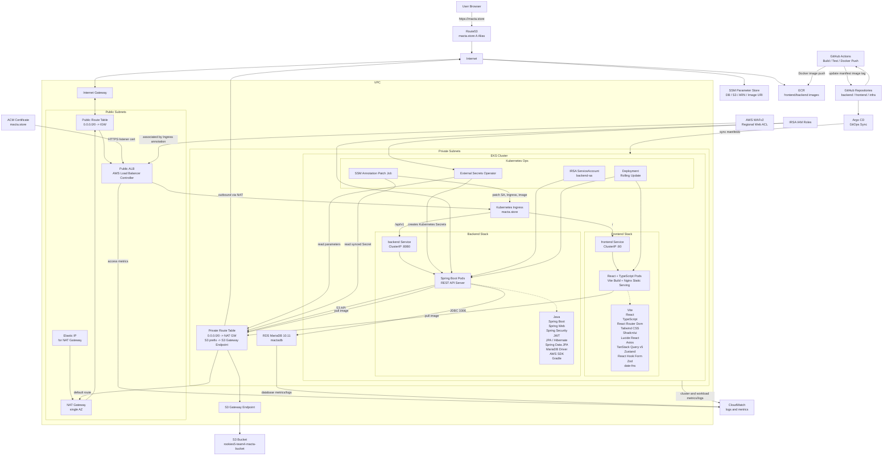
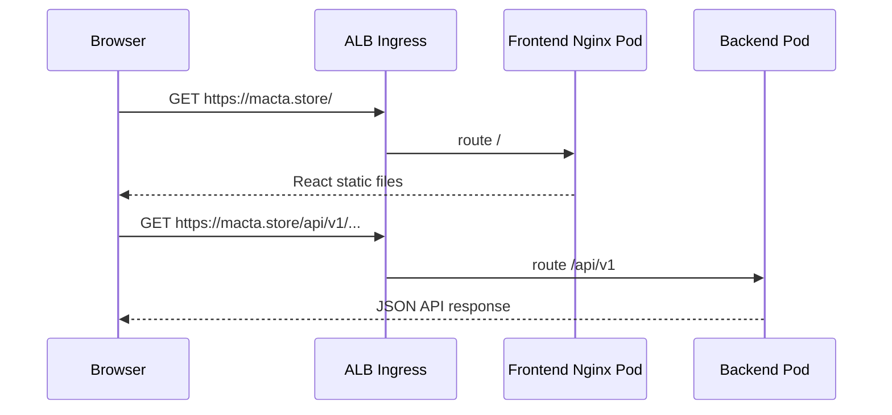

#  실시간 경매 플랫폼 MACTA

> SK쉴더스 루키즈 지능형 애플리케이션 개발 5기 Mini Project 3 - 4조

**MACTA**: 사용자가 **상품을 등록**하고 **실시간 입찰**에 참여할 수 있는 **경매 플랫폼**으로, 경매 마감 직전에 **트래픽이 집중**되는 상황과 다양한 **보안 위협** 환경에서도 안정적으로 동작하도록 설계된 서비스

- **낙관적 락** 기반 **동시성 제어**를 통해 마감 직전 입찰 경쟁에서 발생할 수 있는 **Race Condition**, **중복 갱신**, **데이터 무결성** 문제를 방지
- **WAF**를 **ALB 앞단**에 구성하여 매크로성 반복 요청, **DDoS**, **SQL Injection**, **XSS**, **패킷 위변조** 등 **비정상 트래픽**을 사전에 차단하도록 구성
- **Kubernetes** 기반 배포 환경을 구축하여 **애플리케이션 컨테이너**를 안정적으로 운영하고, 트래픽 증가 상황에서도 **서비스 확장**과 **복구** 가능
- **Rolling Update** 전략을 적용하여 새로운 버전 배포 시에도 기존 **Pod**와 신규 **Pod**를 순차적으로 교체함으로써 **서비스 중단을 최소화**

&nbsp;

## 📌 Application


&nbsp;

### 경매 비즈니스 로직


- 사용자가 **경매 상품**에 입찰하면 서버에서 **경매 진행 상태**, **종료 시간**, **현재 최고 입찰가**를 먼저 확인한 뒤 **입찰 가능 여부**를 판단
- **입찰 금액**은 현재 최고 입찰가보다 높은 경우에만 허용하여 **낮은 금액 입찰**이나 **동일 금액 중복 입찰**이 저장되지 않도록 검증
- **음수 금액**, **0원 입찰**, **필수 값 누락**, 종료된 경매에 대한 입찰 요청 등 **비정상 요청**을 사전에 차단하도록 **입력값 검증**을 수행
- 유효한 입찰이 등록되면 경매의 **현재 최고가**와 **최고 입찰자 정보**를 함께 갱신하여 이후 사용자에게 **최신 입찰 상태**가 반영되도록 처리
- **경매 종료 시점**에는 경매 상태를 **CLOSED**로 변경하고 마지막 최고 입찰자를 **최종 낙찰자**로 확정하여 **거래 단계**로 이어질 수 있도록 구성
- **댓글 및 답글 기능**을 제공하여 상품 상세 페이지에서 **구매 문의**, **판매자 답변**, 사용자 간 **질의응답**

&nbsp;

### 경매 종료 스케줄링


- **백엔드 스케줄러**가 일정 주기로 실행되며 진행 중인 경매 목록에서 **종료 시간이 지난 경매**를 조회
- **만료 대상 경매**를 선별할 때 이미 종료 처리된 경매는 제외하여 **중복 종료 처리**와 불필요한 **상태 변경**이 발생하지 않도록 구현
- 종료 시간이 지난 경매는 **추가 입찰**을 받을 수 없도록 상태를 변경하고, **현재 최고 입찰 내역**을 기준으로 **낙찰자**를 확정
- **입찰자가 존재하지 않는 경매**는 낙찰자 없이 종료 상태로 처리하여 **결제 및 배송 단계**가 생성되지 않도록 분기
- **스케줄러 기반 자동 처리**를 통해 관리자가 직접 경매를 마감하지 않아도 정해진 시간에 경매가 종료

&nbsp;

### 결제 및 배송


> **낙찰자 결제**


> **판매자 배송**

- 경매가 종료되고 **낙찰자**가 확정되면 해당 낙찰자를 기준으로 **거래 정보**가 생성되며 **결제 대기 상태**로 전환
- 낙찰자는 **마이페이지** 또는 **거래 화면**에서 낙찰 상품과 **최종 결제 금액**을 확인한 뒤 **결제 절차**를 진행 가능
- **결제 완료** 시 거래 상태를 결제 완료로 변경하고 판매자가 **배송 정보**를 입력하거나 배송을 시작할 수 있는 단계로 이어지도록 처리
- **판매자**는 결제 완료된 거래를 기준으로 배송을 진행하며, **배송 상태 변경 내역**이 구매자 화면에도 반영
- 거래 진행 단계에 따라 **결제 대기**, **결제 완료**, **배송 진행**, **거래 완료** 등의 상태를 관리하여 사용자별로 필요한 액션만 노출
- **낙찰자**와 **판매자**의 역할을 구분하여 결제는 낙찰자만, 배송 처리는 판매자만 수행할 수 있도록 **권한 흐름**을 분리

&nbsp;

### 동시성 제어

```java
@Entity
@Table(name = "auctions")
@Getter
@NoArgsConstructor(access = AccessLevel.PROTECTED)
@AllArgsConstructor
@Builder
public class Auction {

    @Id
    @GeneratedValue(strategy = GenerationType.IDENTITY)
    private Long id;

    @Column(name = "current_price", nullable = false)
    private Long currentPrice;

    @Version
    @Column(nullable = false)
    private Long version;

    public void updateCurrentPrice(Long bidPrice) {
        this.currentPrice = bidPrice;
    }
}
```

```java
@Service
@RequiredArgsConstructor
@Transactional(readOnly = true)
public class BidService {

    private final AuctionRepository auctionRepository;

    @Transactional
    public void placeBid(Long auctionId, Long bidPrice) {

        Auction auction = auctionRepository.findById(auctionId)
                .orElseThrow();

        // 현재 최고가보다 높은 경우만 입찰 허용
        if (bidPrice <= auction.getCurrentPrice()) {
            throw new IllegalArgumentException("INVALID_BID_PRICE");
        }

        // Optimistic Lock 기반 최고가 갱신
        auction.updateCurrentPrice(bidPrice);
    }
}
```

- 경매 마감 직전에 여러 사용자의 **입찰 요청**이 동시에 들어오는 상황에서도 **데이터 무결성**을 보장하기 위해 **낙관적 락(Optimistic Lock)**을 적용
- **Auction 엔티티**에 `@Version` 필드를 두어 같은 경매 데이터를 동시에 수정하려는 요청이 발생하면 **버전 충돌**을 감지
- 입찰 처리 시 **현재 최고가 검증**과 **최고가 갱신**을 하나의 **트랜잭션** 안에서 수행하여 검증 시점과 저장 시점의 **데이터 불일치**를 줄임
- 동시에 들어온 입찰 요청 중 먼저 **커밋**된 요청만 경매 정보를 갱신하고, 이후 충돌이 발생한 요청은 **실패 처리**되어 잘못된 최고가 덮어쓰기를 방지
- 동일 경매에 대한 **중복 갱신**과 **Race Condition** 문제를 방지하여 **최종 입찰가**와 **낙찰자 정보**가 일관되게 저장

&nbsp;

### 실시간 알림


- 사용자가 참여한 경매에서 **새로운 입찰**, **경매 종료**, **낙찰 결과**와 같은 이벤트가 발생하면 **알림 데이터**가 생성
- **입찰자**, **낙찰자**, **판매자**처럼 이벤트와 관련된 사용자에게 필요한 알림만 전달되도록 **수신 대상**을 구분
- 사용자가 서비스 이용 중 중요한 **경매 상태 변화**를 즉시 확인할 수 있도록 **실시간 알림** 형태로 이벤트를 전달
- **읽지 않은 알림 개수**를 사용자별로 관리하여 마이페이지 또는 알림 영역에서 확인하지 않은 알림 수를 표시할 수 있도록 구성
- 사용자가 알림을 확인하면 **읽음 상태**로 변경하여 이미 확인한 알림과 새로 도착한 알림을 구분할 수 있도록 구현

&nbsp;

### 인증 및 인가


- **JWT 기반 인증** 방식을 적용하여 로그인 성공 시 발급된 토큰으로 사용자의 요청을 식별 가능
- **보호된 API 요청**에서는 토큰의 **유효성**을 검증하고 인증된 사용자 정보가 필요한 **비즈니스 로직**에 전달되도록 구성
- 로그인한 사용자만 **입찰 등록**, **결제 진행**, **마이페이지 조회**, **관심 상품 관리**와 같은 주요 기능을 사용할 수 있도록 제한
- **상품 수정 및 삭제 요청**에서는 요청 사용자와 상품 등록자를 비교하여 **판매자 본인**만 상품 정보를 변경할 수 있도록 검증
- **거래 정보**, **입찰 내역**, **배송 처리 기능**에서는 낙찰자와 판매자의 역할을 구분하여 타인의 거래 정보를 임의로 수정할 수 없도록 제어
- **인증되지 않은 요청**이나 **권한이 없는 요청**은 비즈니스 로직 실행 전에 차단하여 **사용자 데이터**가 노출되거나 변경되지 않도록 처리

&nbsp;

### 마이페이지


- 사용자가 등록한 **경매 상품 목록**을 제공하여 **판매 중인 상품**, **종료된 상품**, **낙찰 여부**를 한 화면에서 확인 가능
- 사용자가 참여한 **입찰 내역**을 제공하여 입찰한 상품, **입찰 금액**, **경매 진행 상태**, **낙찰 여부**를 추적
- **낙찰된 거래**와 **판매 중인 거래**의 진행 상태를 사용자 기준으로 분리하여 **결제 필요 여부**와 **배송 처리 필요 여부**를 확인할 수 있도록 구성

&nbsp;

## 🚀 Infrastructure & Deployment


&nbsp;

### AWS 네트워크 분리


- **Public Subnet**에는 외부 요청을 수신하는 **ALB(Application Load Balancer)**와 Private Subnet의 아웃바운드 통신을 위한 **NAT Gateway**를 배치
- **Private Subnet**에는 실제 애플리케이션이 실행되는 **EKS**, 세션 및 실시간 처리에 활용되는 **Redis**, 영속 데이터를 저장하는 **RDS MariaDB**를 구성하여 내부망 기반으로 운영
- 외부 사용자는 **ALB까지만 접근** 가능하며, 애플리케이션 Pod와 데이터베이스는 **Private 네트워크 내부**에서만 통신하도록 분리
- 데이터베이스와 캐시 계층을 외부에 직접 노출하지 않아 **공격 표면을 최소화**하고, 장애 발생 시에도 네트워크 계층별로 문제 범위를 분리해 대응할 수 있도록 설계

&nbsp;

### GitOps 기반 CI/CD


- 개발자가 애플리케이션 코드를 변경하면 **GitHub Actions**가 자동으로 테스트 및 빌드 과정을 수행하고, **Docker Image**를 생성한 뒤 **Amazon ECR**에 Push
- 배포 대상 이미지 태그와 Kubernetes 설정은 **Infra Repository의 Manifest**로 관리하여, 애플리케이션 코드와 배포 상태를 명확히 분리
- **Argo CD**가 Infra Repository의 변경 사항을 감지하고, 선언된 Manifest와 실제 **EKS 클러스터 상태**를 비교하여 자동으로 동기화
- 배포 이력과 설정 변경이 모두 Git에 남기 때문에 **추적 가능성**, **롤백 용이성**, **운영 일관성**을 확보

&nbsp;

### 무중단 배포


- **Kubernetes Rolling Update** 전략을 적용하여 기존 Pod를 한 번에 종료하지 않고, 새로운 버전의 Pod를 순차적으로 생성한 뒤 트래픽을 전환
- 신규 Pod가 **Readiness Probe**를 통과한 경우에만 서비스 트래픽을 받을 수 있도록 구성하여, 준비되지 않은 애플리케이션으로 요청이 전달되는 상황을 방지
- 배포 중 문제가 발생하면 이전 ReplicaSet으로 되돌릴 수 있어 **서비스 중단 시간 최소화**와 **빠른 장애 복구**가 가능
- 실시간 입찰 서비스 특성상 배포 중에도 사용자의 입찰 요청과 WebSocket 연결 흐름이 최대한 유지되도록 **가용성 중심의 배포 방식**을 적용

&nbsp;

## 🔐 Security & Network

### AWS WAF 적용

- **AWS WAF**를 **ALB 앞단**에 배치하여 애플리케이션 서버로 요청이 전달되기 전에 1차 보안 필터링을 수행
- **SQL Injection**, **XSS**, 비정상 User-Agent, 과도한 반복 요청 등 웹 취약점을 노리는 트래픽을 사전에 차단
- **Rate Limit Rule**을 적용하여 특정 IP에서 짧은 시간 동안 과도하게 요청하는 패턴을 제한하고, 입찰 API나 로그인 API에 대한 악성 반복 호출을 완화
- 보안 규칙을 인프라 계층에서 적용함으로써 애플리케이션 코드 변경 없이도 **공통 보안 정책**을 일관되게 유지

&nbsp;

### HTTPS / WSS 암호화 통신

- **ACM(AWS Certificate Manager)** 인증서를 활용하여 사용자와 서비스 간 통신에 **HTTPS**를 적용
- 실시간 알림과 입찰 상태 전달에 사용되는 WebSocket 역시 **WSS(WebSocket Secure)** 기반으로 구성하여 양방향 통신 구간을 암호화
- 전송 구간에서 발생할 수 있는 **패킷 위변조**, **스니핑**, **중간자 공격(MITM)** 위험을 줄이고 사용자 인증 정보와 거래 데이터를 보호
- 브라우저 보안 정책에 맞는 안전한 연결을 제공하여 로그인, 결제, 실시간 알림 같은 주요 기능이 신뢰된 채널에서 동작하도록 구성

&nbsp;

### Secret 관리

- **DB 비밀번호**, **JWT Secret**, **Redis 접속 정보**, 외부 API Key와 같은 민감 정보는 Git Repository와 Kubernetes Manifest에 직접 저장하지 않도록 분리
- 민감 값은 **AWS SSM Parameter Store**에 저장하고, 클러스터 내부에서는 **External Secrets Operator**를 통해 **Kubernetes Secret**으로 동기화하여 사용
- Secret 변경 시 애플리케이션 설정 파일이나 Manifest를 직접 수정하지 않아도 되어 **비밀 값 노출 위험**과 **운영 실수**를 줄임
- 코드와 설정 저장소에는 Secret의 실제 값이 아닌 참조 구조만 남기므로, 협업 과정에서도 **민감 정보 유출 가능성**을 최소화

&nbsp;

### IRSA 기반 AWS 권한 관리

- Pod 내부에 장기 **Access Key**를 직접 저장하지 않고, **IRSA(IAM Roles for Service Accounts)**를 적용하여 AWS 권한을 부여
- **Kubernetes ServiceAccount**와 **IAM Role**을 연결해 특정 Pod가 필요한 AWS 리소스에만 접근할 수 있도록 **최소 권한 원칙**을 적용
- 예를 들어 S3 업로드가 필요한 Pod에는 S3 관련 권한만 부여하고, 다른 Pod에는 해당 권한이 전달되지 않도록 역할을 분리
- Access Key 유출 위험을 제거하고, 워크로드 단위로 권한을 추적할 수 있어 **보안성**과 **감사 가능성**을 높임

&nbsp;

### Private S3 통신

- **S3 Gateway VPC Endpoint**를 적용하여 Private Subnet의 애플리케이션이 인터넷을 거치지 않고 **AWS 내부 네트워크**를 통해 S3에 접근하도록 구성
- 이미지 업로드 및 조회 과정에서 S3 트래픽이 외부 인터넷 경로로 나가지 않도록 하여 **네트워크 보안성**과 **전송 안정성**을 강화
- **S3 Bucket Public Access**를 비활성화하여 외부 공개 접근을 차단하고, 필요한 요청만 애플리케이션과 IAM 정책을 통해 제어
- VPC Endpoint와 Bucket 정책을 함께 사용해 허용된 네트워크와 권한 주체만 S3를 사용할 수 있도록 **접근 제어 범위**를 명확히 제한

&nbsp;

## 🔧 Tech Stack

### Backend

#### Language & Framework


#### Authentication & Realtime


#### Database & Storage


#### AWS & Build


&nbsp;

### Frontend

#### Core


#### UI & Styling


#### State & Data


#### Form & Validation


#### Build & Container


&nbsp;

### Infrastructure

#### Infrastructure as Code


#### Network


#### Kubernetes & Compute


#### Database & Storage


#### Security


#### CI/CD & Monitoring


&nbsp;

## 🔗 Repository

- [**Backend Repository**](https://github.com/SK-Rookies5-Auction/backend)
- [**Frontend Repository**](https://github.com/SK-Rookies5-Auction/frontend)
- [**Infra Repository**](https://github.com/SK-Rookies5-Auction/infra)

&nbsp;

## 💻 Developers

| <a href="https://github.com/owhat02" target="_blank"></a> | <a href="https://github.com/Eojinn" target="_blank"></a> | <a href="https://github.com/Hyeonseok93" target="_blank"></a> | <a href="https://github.com/mmije0ng" target="_blank"></a> | <a href="https://github.com/seoyeon020" target="_blank"></a> | <a href="https://github.com/JangSeonguk1011" target="_blank"></a> |
| :----------------------------------------------------------------------------------------------------------------------------: | :--------------------------------------------------------------------------------------------------------------------------: | :------------------------------------------------------------------------------------------------------------------------------------: | :------------------------------------------------------------------------------------------------------------------------------: | :----------------------------------------------------------------------------------------------------------------------------------: | :--------------------------------------------------------------------------------------------------------------------------------------------: |
|                                           [이새연(팀장)](https://github.com/owhat02)                                           |                                             [김어진](https://github.com/Eojinn)                                              |                                                [김현석](https://github.com/Hyeonseok93)                                                |                                              [박미정](https://github.com/mmije0ng)                                               |                                               [임서연](https://github.com/seoyeon020)                                                |                                                  [장성욱](https://github.com/JangSeonguk1011)                                                  |

&nbsp;

## Frontend details (`MACTA-frontend`)


<div align="center">
  <p align="center">
    <strong>"留덇컧 吏곸쟾 吏쒕┸???낆같 寃쎌웳, ?ㅼ떆媛??뚰넻怨??덉쟾??嫄곕옒???쒖옉"</strong>
  </p>

  <p align="center">
    
    
    
    
    
    
  </p>
</div>

---

## ?? ?꾨줈?앺듃 媛쒖슂 (Overview)

**MACTA Frontend**???ъ슜?먭? 媛꾪렪?섍쾶 寃쎈ℓ ?곹뭹???깅줉?섍퀬 ?ㅼ떆媛꾩쑝濡??낆같 寃쎌웳??李몄뿬?????덈룄濡?援ы쁽??諛섏쓳?????좏뵆由ъ??댁뀡?낅땲?? 

寃쎈ℓ 留덇컧 吏곸쟾 ?몃옒?쎌씠 紐곕━???숈쟻 ?섍꼍?먯꽌 ?ъ슜??寃쏀뿕??洹밸??뷀븯湲??꾪빐, ?ㅼ떆媛??곹깭 ?숆린??諛?利됯컖?곸씤 UI ?쇰뱶諛깆쓣 ?쒓났?⑸땲?? ?먰븳 JWT ?몄쬆 泥닿퀎瑜?湲곕컲?쇰줈 媛쒖씤?붾맂 ?€?쒕낫??留덉씠?섏씠吏€)?€ 寃곗젣/諛곗넚 ?먮쫫 ?쒖뼱, ?ㅼ떆媛??뱀냼耳??뚮┝ ?섏떊 ?명꽣?섏씠?ㅻ? 援ъ꽦?섏??듬땲??

---

## ???듭떖 湲곕뒫 (Key Features)

### ?룧 ?ㅼ떆媛?寃쎈ℓ ?먯깋 (Home & Search)
- **移댄뀒怨좊━ ?꾪꽣 諛?寃€??*: 愿€???덈뒗 ?곹뭹 移댄뀒怨좊━瑜??꾪꽣留곹븯怨?寃€?됱뼱 ?낅젰???듯빐 ?곹뭹??鍮좊Ⅴ寃?寃€?됲빀?덈떎.
- **?멸린 & 留덇컧 ?꾨컯 ?곹뭹**: ?꾩옱 議고쉶?섎굹 ?낆같 李몄뿬?꾧? ?믪? ?멸린 寃쎈ℓ ?곹뭹 諛?怨?留덇컧???곹뭹?ㅼ쓣 硫붿씤 ?붾㈃???곗꽑 ?몄텧?⑸땲??

### ?뵍 ?ъ슜???몄쬆 諛??멸? (Authentication)
- **JWT 湲곕컲 濡쒓렇???뚯썝媛€??*: 濡쒓렇???깃났 ???띾뱷???좏겙??湲곕컲?쇰줈 ?멸????붿껌???쒕쾭濡??꾨떖?⑸땲??
- **API Interceptor**: Axios Interceptor瑜?援ъ꽦?섏뿬 API ?붿껌 ?ㅻ뜑???좏겙???먮룞?쇰줈 二쇱엯?섍퀬 留뚮즺???€?묓빀?덈떎.

### ?뵇 寃쎈ℓ ?곸꽭 諛??낆같 寃쎌웳 (Product Details & Bidding)
- **?ㅼ떆媛??낆같**: 理쒓퀬媛€ 寃€利?濡쒖쭅??留욎텛???ъ슜?먭? 利됱떆 ?낆같???쒕룄?????덉쑝硫? ?낆같 ?깃났 ??理쒓퀬 ?낆같媛€ ?곹깭媛€ ?ㅼ떆媛꾩쑝濡?諛섏쁺?⑸땲??
- **臾몄쓽 諛??뚰넻**: ?곹뭹 ?섎떒??Q&A ?뺥깭???볤? 諛??듦? ?깅줉 湲곕뒫???쒓났?섏뿬 ?먮ℓ?먯? 援щℓ??媛??먯쑀濡쒖슫 ?섏궗?뚰넻??媛€?ν빀?덈떎.

### ?뵪 寃쎈ℓ ?곹뭹 異쒗뭹 (Register Auction)
- **?뺣낫 ?ㅼ젙**: ?곹뭹 ?대?吏€ ?깅줉, 寃쎈ℓ ?쒖옉 媛€寃? 移댄뀒怨좊━ ?ㅼ젙, 洹몃━怨?寃쎈ℓ 留덇컧 ?쒖젏???щ젰 而댄룷?뚰듃濡?吏€?뺥븯???곹뭹??媛꾪렪?섍쾶 ?깅줉?⑸땲??

### ?뮩 寃곗젣 諛?嫄곕옒 吏꾪뻾 (Checkout & Delivery)
- **?숈같 嫄곕옒 愿€由?*: 寃쎈ℓ 留덇컧 ???숈같?먮줈 ?뺤젙?섎㈃ 寃곗젣 ?€湲??곹깭濡??꾪솚?섎ʼn, 諛곗넚 ?뺣낫(二쇱냼吏€ ??瑜??낅젰?섍퀬 理쒖쥌 寃곗젣瑜??섑뻾?⑸땲??
- **諛곗넚 ?곹깭 ?몃옒??*: ?먮ℓ?먮뒗 寃곗젣 ?꾨즺??嫄댁뿉 ?€??諛곗넚 泥섎━瑜?吏꾪뻾?섍퀬, 援щℓ?먮뒗 ?붾㈃?먯꽌 ?대? ?ㅼ떆媛꾩쑝濡?紐⑤땲?곕쭅?????덉뒿?덈떎.

### ?뵒 ?ㅼ떆媛??대깽???뚮┝ (Notifications Hub)
- **?ㅼ떆媛??뚮┝ 紐⑸줉**: ?ㅻⅨ ?ъ슜?먭? ???믪? 湲덉븸?쇰줈 ?낆같?섏뿬 ???낆같???곹쉶?뱁뻽嫄곕굹(Outbid), ??寃쎈ℓ媛€ ?숈같?섏뿀???뚯쓽 ?ㅼ떆媛??대깽?몃? 紐⑥븘 ?뺤씤?⑸땲??

---

## ?썱 湲곗닠 ?ㅽ깮 (Tech Stack)

### Core Libraries
- **Framework & Runtime**: React 19 (Vite 湲곕컲 媛쒕컻?섍꼍)
- **Language**: TypeScript
- **Routing**: React Router Dom v7

### Styling & UI Components
- **CSS Engine**: Tailwind CSS v4 (理쒖떊 湲곕뒫 諛?鍮좊Ⅸ 鍮뚮뱶 吏€??
- **Design Utility**: Shadcn UI, Radix UI Primitive
- **Icons**: Lucide React

### State & Data Client
- **Server State Management**: TanStack Query v5 (React Query) - 罹먯떛, ?숈쟻 由ы봽?덉떆 諛??먮룞 ?숆린??泥섎━
- **Global Client State**: Zustand v5 - ?대씪?댁뼵???ъ씠??湲€濡쒕쾶 ?곹깭 愿€由?
- **Network Client**: Axios - API 鍮꾨룞湲??듭떊 諛?怨듯넻 ?ㅼ젙 愿€由?
- **Form & Validation**: React Hook Form, Zod

---

## ?뱛 ?꾨줈?앺듃 援ъ“ (Directory Structure)

```text
MACTA-frontend/
?쒋??€ public/                 # ?뺤쟻 ?먯뀑 諛??뚮퉬肄?
?쒋??€ src/
??  ?쒋??€ api/                # Axios ?몄뒪?댁뒪, Interceptor 諛?API ?붾뱶?ъ씤???뺤쓽
??  ?쒋??€ assets/             # 而댄룷?뚰듃 ?대? ?ъ슜 ?대?吏€/?뺤쟻 ?뚯씪
??  ?쒋??€ components/         # ?ъ궗??媛€?ν븳 怨듯넻 UI 諛??덉씠?꾩썐 而댄룷?뚰듃
??  ??  ?붴??€ ui/             # Shadcn UI 湲곕컲 ?먯옄 而댄룷?뚰듃 (Button, Input, Dialog ??
??  ?쒋??€ hooks/              # 而ㅼ뒪?€ ??諛?怨듯넻 鍮꾩쫰?덉뒪 濡쒖쭅
??  ?쒋??€ pages/              # ?쇱슦??留ㅽ븨 ?섏씠吏€ 而댄룷?뚰듃
??  ??  ?쒋??€ HomePage.tsx            # 寃쎈ℓ ??寃€???섏씠吏€
??  ??  ?쒋??€ LoginPage.tsx           # 濡쒓렇???섏씠吏€
??  ??  ?쒋??€ SignupPage.tsx          # ?뚯썝媛€???섏씠吏€
??  ??  ?쒋??€ ProductDetailPage.tsx   # ?곹뭹 ?곸꽭 諛??낆같/?볤? ?섏씠吏€
??  ??  ?쒋??€ RegisterAuctionPage.tsx # 寃쎈ℓ ?깅줉 ?섏씠吏€
??  ??  ?쒋??€ CheckoutPage.tsx        # 寃곗젣 諛?諛곗넚 愿€由??섏씠吏€
??  ??  ?쒋??€ MyPage.tsx              # 留덉씠?섏씠吏€ ?€?쒕낫??
??  ??  ?쒋??€ NotificationsPage.tsx   # ?ㅼ떆媛??뚮┝ ?쇳꽣 ?섏씠吏€
??  ??  ?붴??€ ErrorPage.tsx           # ?덉쇅 泥섎━ ?섏씠吏€
??  ?쒋??€ store/              # Zustand Store ?뺤쓽 (Auth ?곹깭 ??
??  ?쒋??€ styles/             # ?꾩뿭 ?뚮쭏 諛??ㅽ????ㅼ젙
??  ?쒋??€ utils/              # ?щ㎎??諛?怨듯넻 ?ы띁 ?⑥닔
??  ?쒋??€ App.tsx             # ?쇱슦??諛??꾩뿭 Provider ?ㅼ젙
??  ?쒋??€ main.tsx            # React ?뚮뜑留?吏꾩엯??
??  ?쒋??€ App.css
??  ?붴??€ index.css
?쒋??€ eslint.config.js        # ESLint 由고꽣 ?ㅼ젙
?쒋??€ package.json            # ?섏〈??諛??ㅽ겕由쏀듃 援ъ꽦
?쒋??€ tsconfig.json           # TypeScript 鍮뚮뱶 ?ㅼ젙
?붴??€ vite.config.ts          # Vite 踰덈뱾???ㅼ젙
```

---

## ?숋툘 ?ㅽ뻾 諛?鍮뚮뱶 媛€?대뱶 (Getting Started)

### 1. ?섏〈???⑦궎吏€ ?ㅼ튂
?꾨줈?앺듃 猷⑦듃 ?대뜑 ?뱀? `MACTA-frontend` ?대뜑濡??대룞?????꾨옒 紐낅졊?대? ?낅젰?섏뿬 ?꾩슂???⑦궎吏€瑜??ㅼ튂?⑸땲??
```bash
npm install
```

### 2. 濡쒖뺄 媛쒕컻 ?쒕쾭 ?ㅽ뻾
Vite ??紐⑤뱢 援먯껜(HMR)媛€ ?곸슜??濡쒖뺄 ?쒕쾭瑜?援щ룞?⑸땲??
```bash
npm run dev
```

### 3. ?꾨줈?뺤뀡 鍮뚮뱶
諛고룷???꾨줈?뺤뀡 踰덈뱾???앹꽦?⑸땲??
```bash
npm run build
```

---

## ?숋툘 Vite Template Default Reference

> [!NOTE]
> ?꾨옒 ?댁슜?€ Vite React ?쒗뵆由?湲곕낯 ?앹꽦 ?덈궡臾몄엯?덈떎.

This template provides a minimal setup to get React working in Vite with HMR and some ESLint rules.

Currently, two official plugins are available:

- [@vitejs/plugin-react](https://github.com/vitejs/vite-plugin-react/blob/main/packages/plugin-react) uses [Oxc](https://oxc.rs)
- [@vitejs/plugin-react-swc](https://github.com/vitejs/vite-plugin-react/blob/main/packages/plugin-react-swc) uses [SWC](https://swc.rs/)

### React Compiler

The React Compiler is not enabled on this template because of its impact on dev & build performances. To add it, see [this documentation](https://react.dev/learn/react-compiler/installation).

### Expanding the ESLint configuration

If you are developing a production application, we recommend updating the configuration to enable type-aware lint rules:

```js
export default defineConfig([
  globalIgnores(['dist']),
  {
    files: ['**/*.{ts,tsx}'],
    extends: [
      // Other configs...

      // Remove tseslint.configs.recommended and replace with this
      tseslint.configs.recommendedTypeChecked,
      // Alternatively, use this for stricter rules
      tseslint.configs.strictTypeChecked,
      // Optionally, add this for stylistic rules
      tseslint.configs.stylisticTypeChecked,

      // Other configs...
    ],
    languageOptions: {
      parserOptions: {
        project: ['./tsconfig.node.json', './tsconfig.app.json'],
        tsconfigRootDir: import.meta.dirname,
      },
      // other options...
    },
  },
])
```

You can also install [eslint-plugin-react-x](https://github.com/Rel1cx/eslint-react/tree/main/packages/plugins/eslint-plugin-react-x) and [eslint-plugin-react-dom](https://github.com/Rel1cx/eslint-react/tree/main/packages/plugins/eslint-plugin-react-dom) for React-specific lint rules:

```js
// eslint.config.js
import reactX from 'eslint-plugin-react-x'
import reactDom from 'eslint-plugin-react-dom'

export default defineConfig([
  globalIgnores(['dist']),
  {
    files: ['**/*.{ts,tsx}'],
    extends: [
      // Other configs...
      // Enable lint rules for React
      reactX.configs['recommended-typescript'],
      // Enable lint rules for React DOM
      reactDom.configs.recommended,
    ],
    languageOptions: {
      parserOptions: {
        project: ['./tsconfig.node.json', './tsconfig.app.json'],
        tsconfigRootDir: import.meta.dirname,
      },
      // other options...
    },
  },
])
```


&nbsp;

## Infrastructure runbook (`MACTA-infra`)


SK?대뜑??猷⑦궎利?媛쒕컻 5湲?誘몃땲?꾨줈?앺듃3 ?ㅼ떆媛?寃쎈ℓ ?ъ씠??**MACTA** ?쒕퉬?ㅻ? AWS 湲곕컲?쇰줈 諛고룷?섍린 ?꾪븳 ?명봽???덊룷?낅땲?? Terraform?쇰줈 AWS 由ъ냼?ㅻ? 援ъ꽦?섍퀬, Kubernetes manifest?€ Argo CD瑜??듯빐 EKS ?꾩뿉 ?꾨줎?몄뿏??諛깆뿏???좏뵆由ъ??댁뀡??諛고룷?섎뒗 援ъ“?낅땲??

?꾩옱 援ъ“???듭떖?€ ?ㅼ쓬怨?媛숈뒿?덈떎.

- Terraform: VPC, EKS, RDS, S3, ECR, WAF, IRSA, Helm 湲곕컲 而⑦듃濡ㅻ윭 ?ㅼ튂
- EKS: ?꾨줎?몄뿏?? 諛깆뿏?? Ingress, External Secrets 由ъ냼???ㅽ뻾
- SSM Parameter Store: DB, S3, IAM Role ARN, WAF ARN, ACM ARN ???섍꼍蹂?媛믪쓣 ?€??
- External Secrets Operator: SSM 媛믪쓣 Kubernetes Secret?쇰줈 ?숆린??
- AWS Load Balancer Controller: Kubernetes Ingress瑜?蹂닿퀬 ALB ?앹꽦
- Route53 + ACM: `macta.store` ?꾨찓?멸낵 HTTPS ?몄쬆???곌껐
- ?듭떊 援ъ“: ?뺤쟻 ?뚯씪?€ ?꾨줎??Nginx媛€ ?쒕튃?섍퀬, ?숈쟻 API ?몄텧?€ ALB媛€ `/api/v1` 寃쎈줈濡?諛깆뿏???쒕퉬?ㅼ뿉 吏곸젒 ?꾨떖

&nbsp;
## ?꾩껜 援ъ“




&nbsp;
## ?듭떊 援ъ“

???명봽?쇰뒗 ?섎굹??VPC ?덉뿉??Public Subnet怨?Private Subnet??遺꾨━??援ъ꽦?⑸땲?? ?몃? ?ъ슜?먭? 吏곸젒 ?묎렐?댁빞 ?섎뒗 吏꾩엯?먮쭔 Public Subnet???먭퀬, ?ㅼ젣 ?좏뵆由ъ??댁뀡怨??곗씠?곕쿋?댁뒪??Private Subnet??諛곗튂???몃? ?몄텧 踰붿쐞瑜?以꾩씠??援ъ“?낅땲??

Public Subnet?먮뒗 Public ALB?€ NAT Gateway媛€ 諛곗튂?⑸땲?? ALB???명꽣?룹뿉???ㅼ뼱?ㅻ뒗 HTTP/HTTPS ?붿껌??諛쏅뒗 ?좎씪???몃? 吏꾩엯?먯씠怨? NAT Gateway??Private Subnet??由ъ냼?ㅺ? ?꾩슂??寃쎌슦?먮쭔 ?몃?濡??섍컝 ???덇쾶 ?댁＜???꾩썐諛붿슫???듬줈?낅땲??

Private Subnet?먮뒗 EKS Worker Node, ?꾨줎?몄뿏??Pod, 諛깆뿏??Pod, RDS MariaDB媛€ 諛곗튂?⑸땲?? ?꾨줎?몄뿏?쒖? 諛깆뿏??Pod???몃??먯꽌 吏곸젒 ?묎렐?????녾퀬, ALB Ingress瑜??듯빐?쒕쭔 ?쒕퉬???몃옒?쎌쓣 諛쏆뒿?덈떎. RDS??Public ?묎렐??留됯퀬 Private Subnet ?대??먯꽌留?諛깆뿏?쒓? 3306 ?ы듃濡??묎렐?섎룄濡?援ъ꽦?⑸땲??

Public Subnet怨?Private Subnet???섎늿 ?댁쑀??蹂댁븞 寃쎄퀎瑜?紐낇솗???섍린 ?꾪빐?쒖엯?덈떎. ?몃? ?명꽣?룰낵 吏곸젒 ?곌껐?섎뒗 由ъ냼?ㅻ뒗 ALB濡??쒗븳?섍퀬, ?좏뵆由ъ??댁뀡 ?쒕쾭?€ DB???ъ꽕留앹뿉 ?먮㈃ 怨듦꺽 ?쒕㈃??以꾩씪 ???덉뒿?덈떎. ?먰븳 Private Subnet??Pod媛€ ECR ?대?吏€ pull, SSM Parameter 議고쉶 ???몃? AWS API ?묎렐???꾩슂???뚮뒗 NAT Gateway ?먮뒗 VPC Endpoint瑜??듯빐 ?듭젣??諛⑺뼢?쇰줈留??듭떊?섍쾶 ?⑸땲??

?ъ슜???붿껌 ?먮쫫?€ ?ㅼ쓬怨?媛숈뒿?덈떎.

```text
User Browser
  -> Route53(macta.store)
  -> Public ALB
  -> Kubernetes Ingress
      /        -> frontend Service -> frontend Pod
      /api/v1  -> backend Service  -> backend Pod
```

?꾨줎?몄뿏???붾㈃ ?붿껌?€ `/` 寃쎈줈濡??ㅼ뼱?€ React ?뺤쟻 ?뚯씪???쒕튃?섎뒗 Nginx Pod濡??꾨떖?⑸땲?? API ?붿껌?€ 媛숈? ?꾨찓?몄쓽 `/api/v1` 寃쎈줈濡??ㅼ뼱?ㅺ퀬, ALB Ingress媛€ ???붿껌??諛깆뿏??Service濡??쇱슦?낇빀?덈떎. ?곕씪???꾨줎?몄뿏?쒖? 諛깆뿏?쒕뒗 媛숈? EKS ?대윭?ㅽ꽣 ?덉뿉 ?덉?留? ?ъ슜??facing API ?듭떊?€ ALB Ingress??寃쎈줈 湲곕컲 ?쇱슦?낆쓣 ?듯빐 遺꾨━?⑸땲??

諛깆뿏???대? ?듭떊?€ ?ㅼ쓬怨?媛숈뒿?덈떎.

```text
backend Pod
  -> RDS MariaDB:3306
  -> S3 Bucket(S3 Gateway VPC Endpoint 寃쎌쑀)
  -> Redis
  -> SSM/Secrets 媛믪? External Secrets Operator媛€ Kubernetes Secret?쇰줈 ?숆린??
```

S3???명꽣?룹쓣 ?듯빐 ?고쉶?섏? ?딄퀬 Private Route Table???곌껐??S3 Gateway VPC Endpoint瑜??듯빐 ?묎렐?⑸땲?? Secret 媛믪? manifest??吏곸젒 ?ｌ? ?딄퀬 SSM Parameter Store???€?ν븳 ?? External Secrets Operator媛€ Kubernetes Secret?쇰줈 ?숆린?뷀빐 諛깆뿏??Pod ?섍꼍蹂€?섎줈 二쇱엯?⑸땲??

諛고룷 ?먮쫫?€ GitOps 諛⑹떇?낅땲?? GitHub Actions媛€ ?꾨줎?몄뿏??諛깆뿏???대?吏€瑜?鍮뚮뱶??ECR??push?섍퀬 manifest??image tag瑜?媛깆떊?섎㈃, Argo CD媛€ 蹂€寃??ы빆??媛먯???EKS???먮룞?쇰줈 諛섏쁺?⑸땲?? Kubernetes Deployment??Rolling Update ?꾨왂???ъ슜????Pod媛€ Ready ?곹깭媛€ ????湲곗〈 Pod瑜?援먯껜?섎?濡?諛고룷 以??쒕퉬??以묐떒 媛€?μ꽦??以꾩엯?덈떎.

&nbsp;
## ?붿껌 ?쇱슦??



?꾨줎?몄뿏??Nginx??React ?뺤쟻 ?뚯씪怨?SPA fallback留??대떦?⑸땲??

```nginx
server {
    listen 80;

    location / {
        root /usr/share/nginx/html;
        index index.html;
        try_files $uri $uri/ /index.html;
    }
}
```

?꾨줎?몄뿏?쒖쓽 API base URL?€ 媛숈? ?꾨찓???곷?寃쎈줈瑜?沅뚯옣?⑸땲??

```env
VITE_API_BASE_URL=/api/v1
```

&nbsp;
## AWS&CI/CD 由ъ냼??

| <span style="color:white;background-color:#1F3A5F;padding:4px 8px;border-radius:4px;">援щ텇</span> | <span style="color:white;background-color:#1F3A5F;padding:4px 8px;border-radius:4px;">?곕룞 ?€??/span> | <span style="color:white;background-color:#1F3A5F;padding:4px 8px;border-radius:4px;">??븷</span> |
|---|---|---|
| ?ㅽ듃?뚰겕 | VPC | EKS / RDS / ALB ?ㅽ듃?뚰겕 遺꾨━ 諛??대? ?듭떊 援ъ꽦 |
| ?ㅽ듃?뚰겕 | Public Subnet | Public ALB 諛?NAT Gateway 諛곗튂 |
| ?ㅽ듃?뚰겕 | Private Subnet | EKS Worker Node / Pod / RDS ?대?留?援ъ꽦 |
| ?명꽣???곌껐 | Internet Gateway(IGW) | VPC ?몃? ?명꽣???듭떊 ?쒓났 |
| ?꾩썐諛붿슫??| NAT Gateway | Private Subnet???몃? ?명꽣???묎렐 ?쒓났 |
| DNS | Route53 | macta.store ?꾨찓?몄쓣 ALB濡??곌껐 |
| ?몄쬆??| ACM | HTTPS ?몄쬆???쒓났 |
| 吏꾩엯??| ALB | ?몃? HTTP/HTTPS ?몃옒???섏떊 |
| Ingress ?먮룞??| AWS Load Balancer Controller | Kubernetes Ingress 湲곕컲 ALB ?앹꽦 諛?愿€由?|
| 而⑦뀒?대꼫 ?ㅼ??ㅽ듃?덉씠??| EKS | Kubernetes 湲곕컲 ?좏뵆由ъ??댁뀡 ?댁쁺 |
| ?몃뱶 愿€由?| EKS Node Group | EKS Worker Node ?먮룞 愿€由?|
| 蹂댁븞 | WAFv2 | ALB ?욌떒 ?붿껌 ?꾪꽣留?諛?Rate Limit ?곸슜 |
| 而⑦뀒?대꼫 ?대?吏€ | ECR | Frontend / Backend Docker Image ?€??|
| DB | RDS MariaDB 10.11 | 諛깆뿏???곸냽 ?곗씠???€??|
| 罹먯떆 | Redis | 罹먯떆 諛??ㅼ떆媛??곗씠??泥섎━ |
| ?뚯씪 ?€?μ냼 | S3 | ?대?吏€ 諛??뚯씪 ?€??|
| ?대? S3 ?듭떊 | S3 Gateway VPC Endpoint | Private Subnet?먯꽌 S3 ?묎렐 |
| Secret ?€??| SSM Parameter Store | DB/S3/JWT ?ㅼ젙 ?€??|
| Secret ?숆린??| External Secrets Operator | SSM 媛믪쓣 Kubernetes Secret?쇰줈 蹂€??|
| 沅뚰븳 愿€由?| IRSA | Pod ?⑥쐞 IAM Role ?ъ슜 |
| 諛고룷 ?먮룞??| GitHub Actions | Build / Test / Image Push / Manifest 媛깆떊 |
| GitOps | Argo CD | Kubernetes Manifest ?먮룞 Sync |
| 紐⑤땲?곕쭅 | CloudWatch | EKS / ALB / RDS / WAF 濡쒓렇 諛?硫뷀듃由??섏쭛 |

&nbsp;
## ?붾젆?곕━ 援ъ“

```text
infra/
  argocd/
    backend-application.yml
    frontend-application.yml
  k8s/
    ingress.yaml
    ssm-annotation-patch-job.yaml
    backend/
      namespace.yaml
      backend.yaml
      external-secret.yaml
    frontend/
      frontend.yaml
  terraform/
    main.tf
    variables.tf
    outputs.tf
    vpc.tf
    eks.tf
    ecr.tf
    rds.tf
    s3.tf
    waf.tf
    external-secrets.tf
    aws-load-balancer-controller.tf
    policies/
      aws-load-balancer-controller-iam-policy.json
```

&nbsp;
## Terraform 湲곕낯媛?

| ??ぉ | 媛?|
| --- | --- |
| AWS region | `ap-northeast-2` |
| AWS profile | `team4` |
| Project name | `rookies5-macta` |
| Environment | `dev` |
| EKS cluster | `rookies5-macta-eks` |
| Kubernetes namespace | `rookies5-macta` |
| Backend ServiceAccount | `backend-sa` |
| External Secrets namespace | `external-secrets` |
| External Secrets ServiceAccount | `external-secrets` |
| Domain | `macta.store` |

DB 怨꾩젙 ?뺣낫??`terraform/terraform.tfvars`?먯꽌 愿€由ы빀?덈떎. ???뚯씪?€ Git???щ━吏€ ?딆뒿?덈떎.

```hcl
db_instance_class = "db.t3.micro"
db_name           = "mactadb"
db_username       = "admin"
db_password       = "change-me"
```

&nbsp;
## Terraform ?곸슜

```powershell
cd C:\rookies\macta\infra\terraform
$env:AWS_PROFILE = "team4"

terraform init
terraform fmt
terraform validate
terraform plan
terraform apply
```

kubeconfig ?ㅼ젙:

```powershell
aws eks update-kubeconfig --profile team4 --region ap-northeast-2 --name rookies5-macta-eks
```

二쇱슂 output ?뺤씤:

```powershell
terraform output -raw eks_cluster_name
terraform output -raw ecr_backend_repository_url
terraform output -raw ecr_frontend_repository_url
terraform output -raw backend_sa_role_arn
terraform output -raw rds_db_url
terraform output -raw s3_bucket_name
terraform output -raw waf_web_acl_arn
```

&nbsp;
## SSM Parameter Store

Kubernetes YAML?먮뒗 DB 鍮꾨?踰덊샇, DB URL, ARN, ?몄쬆??ARN 媛숈? ?섍꼍蹂?媛믪쓣 吏곸젒 ?ｌ? ?딆뒿?덈떎. SSM Parameter Store???€?ν븯怨?External Secrets Operator媛€ Kubernetes Secret?쇰줈 ?숆린?뷀빀?덈떎.

?꾩옱 manifest媛€ 李몄“?섎뒗 SSM 寃쎈줈???ㅼ쓬怨?媛숈뒿?덈떎.

| SSM parameter | ?⑸룄 |
| --- | --- |
| `/rookies5-macta/dev/backend/DB_URL` | 諛깆뿏??DB JDBC URL |
| `/rookies5-macta/dev/backend/DB_USERNAME` | DB ?ъ슜?먮챸 |
| `/rookies5-macta/dev/backend/DB_PASSWORD` | DB 鍮꾨?踰덊샇 |
| `/rookies5-macta/dev/backend/S3_BUCKET_NAME` | S3 踰꾪궥紐?|
| `/rookies5-macta/dev/backend/AWS_REGION` | AWS region |
| `/rookies5-macta/dev/infra/BACKEND_ROLE_ARN` | 諛깆뿏??IRSA Role ARN |
| `/rookies5-macta/dev/infra/WAF_WEB_ACL_ARN` | WAF Web ACL ARN |
| `/rookies5-macta/dev/infra/ACM_CERTIFICATE_ARN` | ACM ?몄쬆??ARN |
| `/rookies5-macta/dev/infra/BACKEND_IMAGE` | 諛깆뿏???대?吏€ URI |
| `/rookies5-macta/dev/infra/FRONTEND_IMAGE` | ?꾨줎?몄뿏???대?吏€ URI |

SSM 媛??앹꽦 ?덉떆:

```powershell
cd C:\rookies\macta\infra\terraform

$backendRoleArn = terraform output -raw backend_sa_role_arn
$wafWebAclArn   = terraform output -raw waf_web_acl_arn
$backendImage   = "$(terraform output -raw ecr_backend_repository_url):latest"
$frontendImage  = "$(terraform output -raw ecr_frontend_repository_url):latest"
$dbUrl          = terraform output -raw rds_db_url
$s3BucketName   = terraform output -raw s3_bucket_name

aws ssm put-parameter --profile team4 --region ap-northeast-2 --name "/rookies5-macta/dev/backend/DB_URL" --type SecureString --value $dbUrl --overwrite
aws ssm put-parameter --profile team4 --region ap-northeast-2 --name "/rookies5-macta/dev/backend/DB_USERNAME" --type SecureString --value "admin" --overwrite
aws ssm put-parameter --profile team4 --region ap-northeast-2 --name "/rookies5-macta/dev/backend/DB_PASSWORD" --type SecureString --value "CHANGE_ME" --overwrite
aws ssm put-parameter --profile team4 --region ap-northeast-2 --name "/rookies5-macta/dev/backend/S3_BUCKET_NAME" --type SecureString --value $s3BucketName --overwrite
aws ssm put-parameter --profile team4 --region ap-northeast-2 --name "/rookies5-macta/dev/backend/AWS_REGION" --type String --value "ap-northeast-2" --overwrite

aws ssm put-parameter --profile team4 --region ap-northeast-2 --name "/rookies5-macta/dev/infra/BACKEND_ROLE_ARN" --type SecureString --value $backendRoleArn --overwrite
aws ssm put-parameter --profile team4 --region ap-northeast-2 --name "/rookies5-macta/dev/infra/WAF_WEB_ACL_ARN" --type SecureString --value $wafWebAclArn --overwrite
aws ssm put-parameter --profile team4 --region ap-northeast-2 --name "/rookies5-macta/dev/infra/ACM_CERTIFICATE_ARN" --type SecureString --value "CHANGE_ME_ACM_CERTIFICATE_ARN" --overwrite
aws ssm put-parameter --profile team4 --region ap-northeast-2 --name "/rookies5-macta/dev/infra/BACKEND_IMAGE" --type SecureString --value $backendImage --overwrite
aws ssm put-parameter --profile team4 --region ap-northeast-2 --name "/rookies5-macta/dev/infra/FRONTEND_IMAGE" --type SecureString --value $frontendImage --overwrite
```

議고쉶:

```powershell
aws ssm get-parameters-by-path --profile team4 --region ap-northeast-2 --path "/rookies5-macta/dev" --recursive --with-decryption --query "Parameters[*].[Name,Type,Value]" --output table
```

&nbsp;
## External Secrets

Terraform?€ External Secrets Operator瑜?Helm?쇰줈 ?ㅼ튂?⑸땲??

- Namespace: `external-secrets`
- ServiceAccount: `external-secrets`
- ?몄쬆 諛⑹떇: IRSA
- SSM 沅뚰븳: `ssm:GetParameter`, `ssm:GetParameters`, `ssm:GetParametersByPath`, `ssm:DescribeParameters`

Kubernetes manifest:

- `k8s/backend/external-secret.yaml`
  - `ClusterSecretStore`: AWS SSM Parameter Store ?곌껐
  - `ExternalSecret rookies5-macta-backend-secret`: 諛깆뿏???고????섍꼍蹂€??Secret ?앹꽦
  - `ExternalSecret rookies5-macta-infra-config`: IAM Role, WAF, ACM, ?대?吏€ URI Secret ?앹꽦

?뺤씤:

```powershell
kubectl get deployment -n external-secrets external-secrets
kubectl get externalsecret -n rookies5-macta
kubectl get secret backend-secret -n rookies5-macta
kubectl get secret rookies5-macta-infra-config -n rookies5-macta
```

&nbsp;
## Kubernetes 諛고룷

?섎룞 ?곸슜:

```powershell
cd C:\rookies\macta\infra

kubectl apply -f .\k8s\backend\namespace.yaml
kubectl apply -f .\k8s\backend\external-secret.yaml
kubectl apply -f .\k8s\backend\backend.yaml
kubectl apply -f .\k8s\frontend\frontend.yaml
kubectl apply -f .\k8s\ingress.yaml
kubectl apply -f .\k8s\ssm-annotation-patch-job.yaml
```

?뺤씤:

```powershell
kubectl get pods -n rookies5-macta
kubectl get svc -n rookies5-macta
kubectl get ingress -n rookies5-macta
```

&nbsp;
## Ingress, ALB, HTTPS

ALB??Terraform?먯꽌 吏곸젒 ?앹꽦?섏? ?딆뒿?덈떎. Terraform?€ AWS Load Balancer Controller媛€ ?숈옉?????덈룄濡?IAM Role, ServiceAccount, Helm release瑜?援ъ꽦?섍퀬, ?ㅼ젣 ALB??`k8s/ingress.yaml`??Kubernetes Ingress 由ъ냼?ㅻ? AWS Load Balancer Controller媛€ 媛먯????앹꽦?⑸땲??

利? ??援ъ“?먯꽌 Ingress???대윭?ㅽ꽣 ?몃? ?몃옒?쎌쓣 ?꾨줎?몄뿏?쒖? 諛깆뿏??Service濡??섎늻??吏꾩엯 ?쇱슦????븷???⑸땲??

?꾩옱 ?쇱슦??

```text
https://macta.store/        -> rookies5-macta-frontend-service:80
https://macta.store/api/v1  -> rookies5-macta-backend-service:8080
```

?붿껌 ?먮쫫:

```text
User Browser
  -> Route53 macta.store A Alias
  -> Public ALB
  -> Kubernetes Ingress
      /        -> frontend Service -> frontend Pod
      /api/v1  -> backend Service  -> backend Pod
```

?꾨줎?몄뿏?쒕뒗 React ?뺤쟻 ?뚯씪??Nginx濡??쒕튃?섍퀬, API ?몄텧?€ 媛숈? ?꾨찓?몄쓽 `/api/v1` ?곷? 寃쎈줈瑜??ъ슜?⑸땲?? 釉뚮씪?곗?媛€ `https://macta.store/api/v1/...`濡??붿껌?섎㈃ ALB Ingress媛€ ?대떦 ?붿껌??諛깆뿏??Service濡??꾨떖?⑸땲?? ?곕씪???꾨줎?몄뿏??Pod媛€ 諛깆뿏??Pod瑜?吏곸젒 ?몄텧?섎뒗 援ъ“媛€ ?꾨땲?? ?ъ슜??釉뚮씪?곗???API ?붿껌??ALB?€ Ingress??寃쎈줈 湲곕컲 ?쇱슦?낆쓣 ?듯빐 諛깆뿏?쒕줈 ?꾨떖?섎뒗 援ъ“?낅땲??

Ingress 二쇱슂 ?ㅼ젙:

```yaml
metadata:
  annotations:
    kubernetes.io/ingress.class: alb
    alb.ingress.kubernetes.io/scheme: internet-facing
    alb.ingress.kubernetes.io/target-type: ip
    alb.ingress.kubernetes.io/listen-ports: '[{"HTTP":80},{"HTTPS":443}]'
    alb.ingress.kubernetes.io/ssl-redirect: "443"
spec:
  ingressClassName: alb
  rules:
    - host: macta.store
      http:
        paths:
          - path: /api/v1
            pathType: Prefix
            backend:
              service:
                name: rookies5-macta-backend-service
                port:
                  number: 8080
          - path: /
            pathType: Prefix
            backend:
              service:
                name: rookies5-macta-frontend-service
                port:
                  number: 80
```

二쇱슂 annotation ?섎?:

| annotation | ?섎? |
| --- | --- |
| `kubernetes.io/ingress.class: alb` | AWS Load Balancer Controller媛€ 泥섎━??Ingress?꾩쓣 ?쒖떆 |
| `alb.ingress.kubernetes.io/scheme: internet-facing` | ?몃? ?명꽣?룹뿉???묎렐 媛€?ν븳 public ALB ?앹꽦 |
| `alb.ingress.kubernetes.io/target-type: ip` | ALB Target Group??Pod IP瑜?吏곸젒 ?€?곸쑝濡??ъ슜 |
| `alb.ingress.kubernetes.io/listen-ports` | ALB listener ?ы듃 ?ㅼ젙. ?꾩옱 HTTP 80, HTTPS 443 ?ъ슜 |
| `alb.ingress.kubernetes.io/ssl-redirect: "443"` | HTTP ?붿껌??HTTPS濡?由щ떎?대젆??|

WAF/ACM泥섎읆 ?섍꼍留덈떎 ARN???щ씪吏€??媛믪? manifest??吏곸젒 怨좎젙?섏? ?딄퀬 SSM Parameter Store???€?ν빀?덈떎. External Secrets Operator媛€ ??媛믪쓣 `rookies5-macta-infra-config` Secret?쇰줈 ?숆린?뷀븯怨? `ssm-annotation-patch-job`??Ingress annotation?쇰줈 二쇱엯?⑸땲??

- `alb.ingress.kubernetes.io/wafv2-acl-arn`
- `alb.ingress.kubernetes.io/certificate-arn`
- `alb.ingress.kubernetes.io/listen-ports: [{"HTTP":80},{"HTTPS":443}]`
- `alb.ingress.kubernetes.io/ssl-redirect: "443"`

??諛⑹떇?쇰줈 湲곕낯 Ingress ?쇱슦?낆? Git???좎뼵?섍퀬, 怨꾩젙/?섍꼍???곕씪 ?щ씪吏€??WAF Web ACL ARN怨?ACM ?몄쬆??ARN?€ SSM???듯빐 ?고??꾩뿉 諛섏쁺?⑸땲??

?뺤씤:

```powershell
kubectl get ingress rookies5-macta-frontend-ingress -n rookies5-macta
kubectl describe ingress rookies5-macta-frontend-ingress -n rookies5-macta
```

?뺤씤????ぉ:

- `Address`: AWS Load Balancer Controller媛€ ?앹꽦??ALB DNS ?대쫫
- `Rules`: `macta.store` host?€ `/`, `/api/v1` path ?쇱슦??
- `Annotations`: certificate ARN, WAF ACL ARN, HTTPS listener, SSL redirect ?곸슜 ?щ?
- `Events`: ALB, TargetGroup, Listener ?앹꽦 ?먮뒗 ?ㅻ쪟 硫붿떆吏€

&nbsp;
## Route53 and ACM

?꾨찓??

```text
macta.store
```

Route53 public hosted zone???꾩슂???덉퐫??

| ?대쫫 | ?€??| ?€??|
| --- | --- | --- |
| `macta.store` | `A Alias` | ALB dualstack DNS |
| `*.macta.store` | `A Alias` | ALB dualstack DNS, ?꾩슂 ??|
| `_...macta.store` | `CNAME` | ACM DNS validation |

二쇱쓽:

- ACM DNS validation CNAME?€ ?몄쬆??寃€利앹슜?낅땲?? ?쒕퉬???몃옒?쎌쓣 ALB濡?蹂대궡吏€ ?딆뒿?덈떎.
- `*.macta.store`??`www.macta.store`, `api.macta.store` 媛숈? ?쒕툕?꾨찓?몄뿉留?留ㅼ묶?⑸땲??
- 猷⑦듃 ?꾨찓??`macta.store`瑜??곕젮硫?蹂꾨룄 `macta.store A Alias -> ALB` ?덉퐫?쒓? ?꾩슂?⑸땲??
- ALB 湲곕낯 DNS濡?HTTPS ?묒냽?섎㈃ ?몄쬆???대쫫??留욎? ?딆븘 釉뚮씪?곗? 寃쎄퀬媛€ ?⑸땲?? 理쒖쥌 ?묒냽?€ `https://macta.store`濡??뺤씤?⑸땲??

DNS ?뺤씤:

```powershell
nslookup macta.store
nslookup macta.store 8.8.8.8
```

&nbsp;
## RDS

?꾩옱 RDS ?붿쭊?€ MySQL???꾨땲??MariaDB?낅땲??

| ??ぉ | 媛?|
| --- | --- |
| Engine | `mariadb` |
| Engine version | `10.11` |
| DB name | `mactadb` |
| Port | `3306` |
| Subnet | Private subnets |
| Public access | disabled |

JDBC URL?€ MariaDB??MySQL ?명솚 ?꾨줈?좎퐳???ъ슜???ㅼ쓬 ?뺥깭濡?援ъ꽦?⑸땲??

```text
jdbc:mysql://<rds-endpoint>:3306/mactadb?serverTimezone=Asia/Seoul&characterEncoding=UTF-8
```

??媛믪? SSM??`/rookies5-macta/dev/backend/DB_URL`???€?ν븯怨? External Secrets媛€ `backend-secret`?쇰줈 ?숆린?뷀빀?덈떎.

&nbsp;
## S3

S3???좏뵆由ъ??댁뀡 ?뚯씪 ?€?μ냼濡??ъ슜?⑸땲??

- Bucket: `rookies5-team4-macta-bucket`
- Public access block ?곸슜
- EKS private subnet?먯꽌 S3 Gateway Endpoint濡??묎렐
- 諛깆뿏??Pod??IRSA Role???듯빐 S3 沅뚰븳 ?ъ슜

諛깆뿏??ServiceAccount:

```text
backend-sa
```

IRSA annotation?€ SSM 媛믪쓣 ?쎌? patch Job??二쇱엯?⑸땲??

```text
eks.amazonaws.com/role-arn=<BACKEND_ROLE_ARN>
```

?뺤씤:

```powershell
kubectl get serviceaccount backend-sa -n rookies5-macta -o yaml
```

&nbsp;
## ECR and Images

Terraform??ECR repository瑜??앹꽦?⑸땲??

```powershell
terraform output -raw ecr_backend_repository_url
terraform output -raw ecr_frontend_repository_url
```

?대?吏€ ?덉떆:

```text
105588835975.dkr.ecr.ap-northeast-2.amazonaws.com/rookies5-macta/backend:<tag>
105588835975.dkr.ecr.ap-northeast-2.amazonaws.com/rookies5-macta/frontend:<tag>
```

?꾩옱 Kubernetes manifest??`image`??placeholder濡??????덉뒿?덈떎. ?ㅼ젣 ?대?吏€??CI/CD ?먮뒗 SSM patch Job?먯꽌 諛섏쁺?⑸땲??

?대?吏€ pull ?ㅻ쪟 ?뺤씤:

```powershell
kubectl describe pod -n rookies5-macta -l app=rookies5-macta-frontend
kubectl describe pod -n rookies5-macta -l app=rookies5-macta-backend
```

&nbsp;
## WAF

Terraform?€ Regional WAF Web ACL???앹꽦?⑸땲??

?곸슜 rule:

- Rate limit per IP
- AWS Managed Rules Common Rule Set
- AWS Managed Rules Known Bad Inputs Rule Set
- AWS Managed Rules SQLi Rule Set

WAF???앹꽦留뚯쑝濡?ALB???먮룞 ?곌껐?섏? ?딆뒿?덈떎. ?꾩옱 援ъ“?먯꽌??WAF ARN??SSM???€?ν븯怨? `ssm-annotation-patch-job`??Ingress annotation?쇰줈 二쇱엯?⑸땲??

```text
alb.ingress.kubernetes.io/wafv2-acl-arn=<WAF_WEB_ACL_ARN>
```

WAF??CloudWatch Metrics?€ full request logging??紐⑤몢 ?ъ슜?⑸땲??

- CloudWatch Metrics: rule蹂?`AllowedRequests`, `BlockedRequests` 吏€???뺤씤
- Sampled requests: WAF Console?먯꽌 ?쇰? ?붿껌 ?섑뵆 ?뺤씤
- CloudWatch Logs full logging: WAF瑜??듦낵?섍굅??李⑤떒???붿껌 ?곸꽭 濡쒓렇 ?€??

Terraform?€ WAF 濡쒓렇 ?€?μ슜 CloudWatch Log Group???앹꽦?⑸땲??

```text
aws-waf-logs-rookies5-macta-dev-web-acl
```

WAF logging ?ㅼ젙:

```text
aws_wafv2_web_acl_logging_configuration
  -> aws_cloudwatch_log_group.waf
```

濡쒓렇?먮뒗 ?붿껌 IP, URI, HTTP method, User-Agent, WAF action, rule match ?뺣낫 ?깆씠 ?€?λ맗?덈떎. `authorization`, `cookie` ?ㅻ뜑??誘쇨컧?뺣낫 ?몄텧??以꾩씠湲??꾪빐 redaction 泥섎━?⑸땲??

?뺤씤:

```powershell
terraform output -raw waf_log_group_name
```

CloudWatch Logs Insights ?덉떆:

```sql
fields @timestamp, action, terminatingRuleId, httpRequest.clientIp, httpRequest.uri, httpRequest.httpMethod
| sort @timestamp desc
| limit 50
```

Rate Limit 李⑤떒 ?붿껌留??뺤씤:

```sql
fields @timestamp, action, terminatingRuleId, httpRequest.clientIp, httpRequest.uri
| filter action = "BLOCK"
| filter terminatingRuleId = "RateLimitPerIp"
| sort @timestamp desc
| limit 50
```

&nbsp;
## Argo CD
### EKS 諛고룷 ?좏뵆由ъ??댁뀡 ?곹깭 ?뺤씤


### 諛깆뿏???대윭?ㅽ꽣 ??諛고룷 由ъ냼???곹깭 ?뺤씤


### ?꾨줎?몄뿏???대윭?ㅽ꽣 ??諛고룷 由ъ냼???곹깭 ?뺤씤


Argo CD???좏뵆由ъ??댁뀡 諛고룷 ?곹깭瑜??뺤씤?섍퀬 GitOps 諛⑹떇?쇰줈 manifest瑜?sync?섍린 ?꾪븳 ?꾧뎄?낅땲??

?꾨줎?몄뿏??諛깆뿏???덊룷?먯꽌 ?대?吏€ 鍮뚮뱶 ??infra manifest瑜?媛깆떊?섎뜑?쇰룄 Argo CD媛€ 利됱떆 蹂€寃쎌궗??쓣 媛먯??섏? 紐삵븷 ???덉뒿?덈떎. ?대? 以꾩씠湲??꾪빐 Argo CD webhook???④퍡 ?ъ슜?⑸땲?? GitHub push ?대깽?멸? Argo CD webhook?쇰줈 ?꾨떖?섎㈃ Application refresh媛€ ?몃━嫄곕릺??湲곕낯 polling 二쇨린瑜?湲곕떎由ъ? ?딄퀬 鍮좊Ⅴ寃?sync ?€??蹂€寃쎌쓣 媛먯??????덉뒿?덈떎.

?ㅼ튂 ?덉떆:

```powershell
kubectl create namespace argocd
kubectl apply --server-side --force-conflicts -n argocd -f https://raw.githubusercontent.com/argoproj/argo-cd/stable/manifests/install.yaml
```

UI瑜??꾩떆濡?蹂???

```powershell
kubectl port-forward svc/argocd-server -n argocd 8080:443
```

釉뚮씪?곗?:

```text
https://localhost:8080
```

珥덇린 鍮꾨?踰덊샇:

```powershell
$encoded = kubectl get secret argocd-initial-admin-secret -n argocd -o jsonpath="{.data.password}"
[System.Text.Encoding]::UTF8.GetString([System.Convert]::FromBase64String($encoded))
```

LoadBalancer濡??몄텧???섎룄 ?덉?留? ?ㅼ뒿 ?꾩뿉??`ClusterIP`濡??섎룎由щ뒗 寃껋쓣 沅뚯옣?⑸땲??

```powershell
kubectl patch svc argocd-server -n argocd --type merge -p '{"spec":{"type":"LoadBalancer"}}'
kubectl patch svc argocd-server -n argocd --type merge -p '{"spec":{"type":"ClusterIP"}}'
```

GitHub webhook URL:

```text
https://<argocd-server-domain-or-lb>/api/webhook
```

GitHub webhook ?ㅼ젙:

```text
Payload URL: https://<argocd-server-domain-or-lb>/api/webhook
Content type: application/json
Event: Just the push event
```

Argo CD瑜??몃? LoadBalancer濡??몄텧?섏? ?딅뒗 ?댁쁺 ?섍꼍?먯꽌??port-forward ?€??Ingress, VPN, ?щ궡留? ?먮뒗 蹂꾨룄 webhook relay 援ъ꽦???ъ슜?⑸땲??

&nbsp;
## CI/CD 諛⑺뼢

沅뚯옣 ?먮쫫:

```text
Frontend or Backend repo push
  -> GitHub Actions
  -> Docker build
  -> ECR push
  -> infra manifest image tag update commit
  -> GitHub webhook triggers Argo CD refresh
  -> Argo CD sync
  -> EKS rolling update
```

SSM???좎???媛?

- DB URL, username, password
- S3 bucket name
- Backend IRSA Role ARN
- WAF Web ACL ARN
- ACM certificate ARN
- AWS region

?대?吏€ URI???쇰컲?곸쑝濡?誘쇨컧?뺣낫媛€ ?꾨땲誘€濡? ?꾩쟾??GitOps瑜??먰븯硫?manifest???대?吏€ ?쒓렇瑜?而ㅻ컠?섍퀬 Argo CD媛€ sync?섍쾶 ?섎뒗 援ъ“媛€ ???⑥닚?⑸땲??

?꾩옱 SSM 湲곕컲 patch Job??吏€?먰빀?덈떎.

```text
SSM FRONTEND_IMAGE/BACKEND_IMAGE
  -> ExternalSecret
  -> rookies5-macta-infra-config Secret
  -> ssm-annotation-patch-job
  -> kubectl set image
```

&nbsp;
## Rolling Update

?꾨줎?몄뿏?쒖? 諛깆뿏?쒕뒗 Kubernetes Deployment??Rolling Update 諛⑹떇???ъ슜?⑸땲?? ?대?吏€ ?쒓렇媛€ 蹂€寃쎈릺嫄곕굹 Pod template??蹂€寃쎈릺硫?Kubernetes媛€ ??ReplicaSet??留뚮뱾怨? 湲곗〈 Pod瑜???踰덉뿉 紐⑤몢 ?대━吏€ ?딄퀬 ?쒖감?곸쑝濡???Pod濡?援먯껜?⑸땲??

?꾩옱 ?ㅼ젙:

```yaml
replicas: 2
strategy:
  type: RollingUpdate
  rollingUpdate:
    maxSurge: 1
    maxUnavailable: 0
```

?곸슜 ?꾩튂:

```text
k8s/frontend/frontend.yaml
k8s/backend/backend.yaml
```

?숈옉 諛⑹떇:

```text
1. ?꾩옱 frontend/backend Pod??媛곴컖 2媛?replica濡??ㅽ뻾
2. ???대?吏€ ?쒓렇媛€ manifest??諛섏쁺??
3. Argo CD sync ?먮뒗 kubectl apply媛€ Deployment 蹂€寃쎌쓣 ?곸슜
4. Kubernetes媛€ ??ReplicaSet ?앹꽦
5. maxSurge: 1 ?ㅼ젙???곕씪 湲곗〈 2媛?Pod ?꾩뿉 ??Pod 1媛쒕? 異붽?濡??앹꽦
6. readinessProbe媛€ ?깃났????Pod媛€ Ready ?곹깭媛€ ?섎㈃ Service ?몃옒???€?곸뿉 ?ы븿
7. maxUnavailable: 0 ?ㅼ젙???곕씪 Ready Pod ?섎? ?좎??섎㈃??湲곗〈 Pod 1媛?醫낅즺
8. 媛숈? 怨쇱젙??諛섎났??紐⑤뱺 Pod瑜???踰꾩쟾?쇰줈 援먯껜
```

`maxSurge: 1`?€ ?낅뜲?댄듃 以??먰븯??replica ?섎낫??Pod瑜?理쒕? 1媛???留뚮뱾 ???덈떎???섎??낅땲?? `replicas: 2` 湲곗??쇰줈 ?낅뜲?댄듃 以??쇱떆?곸쑝濡?理쒕? 3媛?Pod媛€ ?ㅽ뻾?????덉뒿?덈떎.

`maxUnavailable: 0`?€ ?낅뜲?댄듃 以??ъ슜 媛€?ν븳 Pod ?섎? 以꾩씠吏€ ?딄쿋?ㅻ뒗 ?섎??낅땲?? ??Pod媛€ Ready ?섍린 ?꾩뿉??湲곗〈 Pod瑜?癒쇱? 醫낅즺?섏? ?딆쑝誘€濡? 諛고룷 以??쒕퉬??以묐떒 媛€?μ꽦??以꾩엯?덈떎.

?곕씪????踰꾩쟾 Pod媛€ ?대?吏€ ?ㅻ쪟, ?ㅼ젙 ?ㅻ쪟, ?좏뵆由ъ??댁뀡 湲곕룞 ?ㅽ뙣 ?깆쑝濡?Ready ?곹깭媛€ ?섏? 紐삵븯硫?湲곗〈 Pod媛€ 怨꾩냽 ?좎??⑸땲?? ??寃쎌슦 Rolling Update媛€ 以묎컙?먯꽌 硫덉텛怨?Service??湲곗〈 Ready Pod濡??몃옒?쎌쓣 怨꾩냽 ?꾨떖?섎?濡? ?ㅽ뙣??諛고룷媛€ 怨㏓컮濡??쒕퉬??以묐떒?쇰줈 ?댁뼱吏€吏€ ?딆뒿?덈떎.

readinessProbe????Pod瑜?Service ?몃옒?쎌뿉 ?ｌ뼱???섎뒗吏€ ?먮떒?섎뒗 湲곗??낅땲??

```text
frontend: HTTP GET /, port 80, initialDelaySeconds 10, periodSeconds 5
backend:  TCP socket 8080, initialDelaySeconds 30, periodSeconds 10
```

諛고룷 ?곹깭 ?뺤씤:

```powershell
kubectl rollout status deployment/rookies5-macta-frontend -n rookies5-macta
kubectl rollout status deployment/rookies5-macta-backend -n rookies5-macta
```

ReplicaSet怨?Pod 援먯껜 怨쇱젙 ?뺤씤:

```powershell
kubectl get rs -n rookies5-macta
kubectl get pods -n rookies5-macta -w
```

臾몄젣媛€ ?앷꼈?????댁쟾 踰꾩쟾?쇰줈 濡ㅻ갚:

```powershell
kubectl rollout undo deployment/rookies5-macta-frontend -n rookies5-macta
kubectl rollout undo deployment/rookies5-macta-backend -n rookies5-macta
```

&nbsp;
## ?댁쁺 ?뺤씤 紐낅졊

```powershell
kubectl get pods -n rookies5-macta
kubectl get svc -n rookies5-macta
kubectl get ingress -n rookies5-macta
kubectl describe ingress rookies5-macta-frontend-ingress -n rookies5-macta
kubectl get externalsecret -n rookies5-macta
kubectl get secret backend-secret -n rookies5-macta
kubectl get secret rookies5-macta-infra-config -n rookies5-macta
```

ALB ?묒냽:

```text
http://<alb-dns>
https://macta.store
```

二쇱쓽:

- ALB 湲곕낯 DNS濡?HTTPS ?묒냽?섎㈃ ?몄쬆??mismatch 寃쎄퀬媛€ ?????덉뒿?덈떎.
- 理쒖쥌 HTTPS 寃€利앹? `https://macta.store`濡??⑸땲??
- `macta.store`媛€ DNS ?ㅻ쪟瑜??대㈃ Route53??`macta.store A Alias -> ALB` ?덉퐫?쒖? ?꾨찓???ㅼ엫?쒕쾭 ?꾩엫???뺤씤?⑸땲??

&nbsp;
## Git???щ━吏€ ?딅뒗 ?뚯씪

?ㅼ쓬 ?뚯씪?€ Git???щ━吏€ ?딆뒿?덈떎.

- `terraform/.terraform/`
- `terraform/terraform.tfstate`
- `terraform/terraform.tfstate.backup`
- `terraform/*.tfvars`
- Terraform plan output

